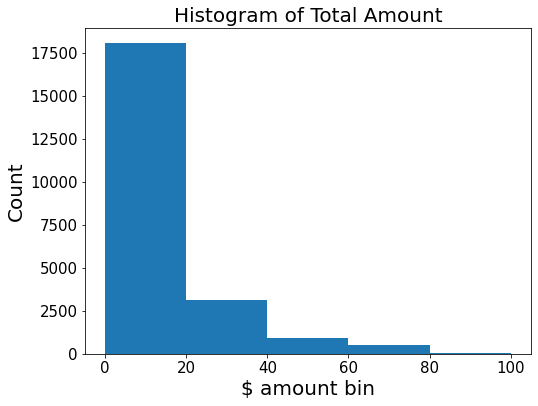
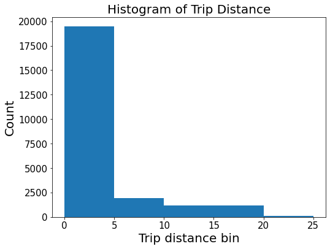

## **Automatidata project**
**Course 2 - Get Started with Python**

# Course 2 end-of-course project: Inspect and analyze data

In this activity, you will examine data provided and prepare it for analysis.  
<br/>   

**The purpose** of this project is to investigate and understand the data provided.
  
**The goal** is to use a dataframe contructed within Python, perform a cursory inspection of the provided dataset and inform team members of your findings. 
<br/>  
*This activity has three parts:*

**Part 1:** Understand the situation 
* How can you best prepare to understand and organize the provided taxi cab information?

**Part 2:** Understand the data

* Create a pandas dataframe for data learning, and future exploratory data analysis (EDA) and statistical activities.

* View and interpret the datasets data table

* Sort and interpret the data table for two variables of your choice.

**Part 3:** Understand the variables

* What is the min, mean, and max of your chosen variables?

* Visualize the variables

<br/> 
Follow the instructions and answer the following questions to complete the activity. Then, you will complete an Executive Summary using the questions listed on the PACE Strategy Document.

Be sure to complete this activity before moving on. The next course item will provide you with a completed exemplar to compare to your own work. 


## **Identify data types and relevant variables using Python**

### **Exercise Instructions:**


**Complete the following step-by-step instructions to inspect and analyze this NYC taxi dataset.**

This activity will help ensure the information is:

1.   Ready to answer questions and yield insights

2.   Ready for visualizations

3.   Ready for future hypothesis testing and statistical methods

**Follow the instructions and answer questions to complete this activity. Afterward,**

1.   Write a short Executive Summary using your findings.

2.  Use the structured notebook provided to help you in this project. Please complete the questions inside and prepare a summary for the data team.

3. Consider the questions presented  in the [Course 2 PACE strategy document](https://docs.google.com/document/d/1JM7h5MAQkD9uxoUhgpVBeT5R15y85LRaMo30I7bIFdk/template/preview).

4.   Compare your data insights with the provided exemplar to confirm of your approach and results.


Throughout these project notebooks, you'll see references to the problem-solving framework PACE. The following notebook components are labeled with the respective PACE stage: Plan, Analyze, Construct, and Execute.

## PACE: **Plan**

### **Step 1a. Understand the situation**

1.   How can you best prepare to understand and organize the provided taxi cab information? 

*Begin by exploring your dataset and consider reviewing the Data Dictionary.*


```python
### **==> EXEMPLAR CODE and OUTPUT**
#
# Question 1: How best to prepare?
#
# Q1 Answer:
# By reading the taxi cab data fields and ensuring I understand how 
# each one impacts the dataset. Reviewing the fact sheet could also 
# provide helpful background information. 

# However, my primary goal is to get the data into Python, inspect it, 
# and provide DeShawn with my initial observations. 
# Afterwards, I can learn more deeply about the data and check
# for any anomalies.

```

### **Step 1b. Import dataframe**


Create a pandas dataframe for data learning, and future exploratory data analysis (EDA) and statistical activities.

**Code the following,**

*   import pandas as pd #library exercise for buidling dataframes

*   import numpy as np                #numpy is imported with pandas

*   import matplotlib.pyplot as plt   #visualization library

*   import seaborn as sns             #visualization library

*   df = pd.read_csv('2017_Yellow_Taxi_Trip_Data.csv')

**Note:** pair the data object name "df" with pandas functions to manipulate data, such as df.groupby().


```python
# ==> EXEMPLAR CODE and OUTPUT
import pandas as pd               #library exercise for buidling dataframes
import numpy as np                #numpy is imported with pandas
import matplotlib.pyplot as plt   #visualization library
import seaborn as sns             #visualization library

df = pd.read_csv('2017_Yellow_Taxi_Trip_Data.csv')
print("done")
```

    done


## PACE: **Analyze**

### **Step 2a. Understand the data - Interpret the data table**

View and interpret the datasets data table by **coding the following:**

1.   df.head(10)
2.   df.info()

*Consider the following two questions:*

**Question 1:** When reviewing the df.head(10) output, are there any data points that surprise you or are not correct? 

**Question 2:** When reviewing the df.info() output, what kind of data types are we working with?


```python
# ==> EXEMPLAR CODE and OUTPUT
df.head(10)
```


<div>
<style scoped>
    .dataframe tbody tr th:only-of-type {
        vertical-align: middle;
    }

    .dataframe tbody tr th {
        vertical-align: top;
    }

    .dataframe thead th {
        text-align: right;
    }
</style>
<table border="1" class="dataframe">
  <thead>
    <tr style="text-align: right;">
      <th></th>
      <th>Unnamed: 0</th>
      <th>VendorID</th>
      <th>tpep_pickup_datetime</th>
      <th>tpep_dropoff_datetime</th>
      <th>passenger_count</th>
      <th>trip_distance</th>
      <th>RatecodeID</th>
      <th>store_and_fwd_flag</th>
      <th>PULocationID</th>
      <th>DOLocationID</th>
      <th>payment_type</th>
      <th>fare_amount</th>
      <th>extra</th>
      <th>mta_tax</th>
      <th>tip_amount</th>
      <th>tolls_amount</th>
      <th>improvement_surcharge</th>
      <th>total_amount</th>
    </tr>
  </thead>
  <tbody>
    <tr>
      <th>0</th>
      <td>24870114</td>
      <td>2</td>
      <td>03/25/2017 8:55:43 AM</td>
      <td>03/25/2017 9:09:47 AM</td>
      <td>6</td>
      <td>3.34</td>
      <td>1</td>
      <td>N</td>
      <td>100</td>
      <td>231</td>
      <td>1</td>
      <td>13.0</td>
      <td>0.0</td>
      <td>0.5</td>
      <td>2.76</td>
      <td>0.0</td>
      <td>0.3</td>
      <td>16.56</td>
    </tr>
    <tr>
      <th>1</th>
      <td>35634249</td>
      <td>1</td>
      <td>04/11/2017 2:53:28 PM</td>
      <td>04/11/2017 3:19:58 PM</td>
      <td>1</td>
      <td>1.80</td>
      <td>1</td>
      <td>N</td>
      <td>186</td>
      <td>43</td>
      <td>1</td>
      <td>16.0</td>
      <td>0.0</td>
      <td>0.5</td>
      <td>4.00</td>
      <td>0.0</td>
      <td>0.3</td>
      <td>20.80</td>
    </tr>
    <tr>
      <th>2</th>
      <td>106203690</td>
      <td>1</td>
      <td>12/15/2017 7:26:56 AM</td>
      <td>12/15/2017 7:34:08 AM</td>
      <td>1</td>
      <td>1.00</td>
      <td>1</td>
      <td>N</td>
      <td>262</td>
      <td>236</td>
      <td>1</td>
      <td>6.5</td>
      <td>0.0</td>
      <td>0.5</td>
      <td>1.45</td>
      <td>0.0</td>
      <td>0.3</td>
      <td>8.75</td>
    </tr>
    <tr>
      <th>3</th>
      <td>38942136</td>
      <td>2</td>
      <td>05/07/2017 1:17:59 PM</td>
      <td>05/07/2017 1:48:14 PM</td>
      <td>1</td>
      <td>3.70</td>
      <td>1</td>
      <td>N</td>
      <td>188</td>
      <td>97</td>
      <td>1</td>
      <td>20.5</td>
      <td>0.0</td>
      <td>0.5</td>
      <td>6.39</td>
      <td>0.0</td>
      <td>0.3</td>
      <td>27.69</td>
    </tr>
    <tr>
      <th>4</th>
      <td>30841670</td>
      <td>2</td>
      <td>04/15/2017 11:32:20 PM</td>
      <td>04/15/2017 11:49:03 PM</td>
      <td>1</td>
      <td>4.37</td>
      <td>1</td>
      <td>N</td>
      <td>4</td>
      <td>112</td>
      <td>2</td>
      <td>16.5</td>
      <td>0.5</td>
      <td>0.5</td>
      <td>0.00</td>
      <td>0.0</td>
      <td>0.3</td>
      <td>17.80</td>
    </tr>
    <tr>
      <th>5</th>
      <td>23345809</td>
      <td>2</td>
      <td>03/25/2017 8:34:11 PM</td>
      <td>03/25/2017 8:42:11 PM</td>
      <td>6</td>
      <td>2.30</td>
      <td>1</td>
      <td>N</td>
      <td>161</td>
      <td>236</td>
      <td>1</td>
      <td>9.0</td>
      <td>0.5</td>
      <td>0.5</td>
      <td>2.06</td>
      <td>0.0</td>
      <td>0.3</td>
      <td>12.36</td>
    </tr>
    <tr>
      <th>6</th>
      <td>37660487</td>
      <td>2</td>
      <td>05/03/2017 7:04:09 PM</td>
      <td>05/03/2017 8:03:47 PM</td>
      <td>1</td>
      <td>12.83</td>
      <td>1</td>
      <td>N</td>
      <td>79</td>
      <td>241</td>
      <td>1</td>
      <td>47.5</td>
      <td>1.0</td>
      <td>0.5</td>
      <td>9.86</td>
      <td>0.0</td>
      <td>0.3</td>
      <td>59.16</td>
    </tr>
    <tr>
      <th>7</th>
      <td>69059411</td>
      <td>2</td>
      <td>08/15/2017 5:41:06 PM</td>
      <td>08/15/2017 6:03:05 PM</td>
      <td>1</td>
      <td>2.98</td>
      <td>1</td>
      <td>N</td>
      <td>237</td>
      <td>114</td>
      <td>1</td>
      <td>16.0</td>
      <td>1.0</td>
      <td>0.5</td>
      <td>1.78</td>
      <td>0.0</td>
      <td>0.3</td>
      <td>19.58</td>
    </tr>
    <tr>
      <th>8</th>
      <td>8433159</td>
      <td>2</td>
      <td>02/04/2017 4:17:07 PM</td>
      <td>02/04/2017 4:29:14 PM</td>
      <td>1</td>
      <td>1.20</td>
      <td>1</td>
      <td>N</td>
      <td>234</td>
      <td>249</td>
      <td>2</td>
      <td>9.0</td>
      <td>0.0</td>
      <td>0.5</td>
      <td>0.00</td>
      <td>0.0</td>
      <td>0.3</td>
      <td>9.80</td>
    </tr>
    <tr>
      <th>9</th>
      <td>95294817</td>
      <td>1</td>
      <td>11/10/2017 3:20:29 PM</td>
      <td>11/10/2017 3:40:55 PM</td>
      <td>1</td>
      <td>1.60</td>
      <td>1</td>
      <td>N</td>
      <td>239</td>
      <td>237</td>
      <td>1</td>
      <td>13.0</td>
      <td>0.0</td>
      <td>0.5</td>
      <td>2.75</td>
      <td>0.0</td>
      <td>0.3</td>
      <td>16.55</td>
    </tr>
  </tbody>
</table>
</div>


```python
# ==> EXEMPLAR CODE and OUTPUT
df.info()
```

    <class 'pandas.core.frame.DataFrame'>
    RangeIndex: 22699 entries, 0 to 22698
    Data columns (total 18 columns):
     #   Column                 Non-Null Count  Dtype  
    ---  ------                 --------------  -----  
     0   Unnamed: 0             22699 non-null  int64  
     1   VendorID               22699 non-null  int64  
     2   tpep_pickup_datetime   22699 non-null  object 
     3   tpep_dropoff_datetime  22699 non-null  object 
     4   passenger_count        22699 non-null  int64  
     5   trip_distance          22699 non-null  float64
     6   RatecodeID             22699 non-null  int64  
     7   store_and_fwd_flag     22699 non-null  object 
     8   PULocationID           22699 non-null  int64  
     9   DOLocationID           22699 non-null  int64  
     10  payment_type           22699 non-null  int64  
     11  fare_amount            22699 non-null  float64
     12  extra                  22699 non-null  float64
     13  mta_tax                22699 non-null  float64
     14  tip_amount             22699 non-null  float64
     15  tolls_amount           22699 non-null  float64
     16  improvement_surcharge  22699 non-null  float64
     17  total_amount           22699 non-null  float64
    dtypes: float64(8), int64(7), object(3)
    memory usage: 3.1+ MB


### **Step 2b. Understand the data - Sort by variables**

Sort and interpret the data table for two variables of your choice.

**Answer the following three questions:**

**Question 1:** Sort your first variable (trip_distance) from maximum to minimum value, do the values seem normal?

**Question 2:** Sort your by your second variable (total_amount), are any values unusual?

**Question 3:** Are the resulting rows similar for both sorts? Why or why not?


```python
# ==> EXEMPLAR CODE and OUTPUT

df_sort = df.sort_values(by=['trip_distance'],ascending=False) 
df_sort.head(10)

```


<div>
<style scoped>
    .dataframe tbody tr th:only-of-type {
        vertical-align: middle;
    }

    .dataframe tbody tr th {
        vertical-align: top;
    }

    .dataframe thead th {
        text-align: right;
    }
</style>
<table border="1" class="dataframe">
  <thead>
    <tr style="text-align: right;">
      <th></th>
      <th>Unnamed: 0</th>
      <th>VendorID</th>
      <th>tpep_pickup_datetime</th>
      <th>tpep_dropoff_datetime</th>
      <th>passenger_count</th>
      <th>trip_distance</th>
      <th>RatecodeID</th>
      <th>store_and_fwd_flag</th>
      <th>PULocationID</th>
      <th>DOLocationID</th>
      <th>payment_type</th>
      <th>fare_amount</th>
      <th>extra</th>
      <th>mta_tax</th>
      <th>tip_amount</th>
      <th>tolls_amount</th>
      <th>improvement_surcharge</th>
      <th>total_amount</th>
    </tr>
  </thead>
  <tbody>
    <tr>
      <th>9280</th>
      <td>51810714</td>
      <td>2</td>
      <td>06/18/2017 11:33:25 PM</td>
      <td>06/19/2017 12:12:38 AM</td>
      <td>2</td>
      <td>33.96</td>
      <td>5</td>
      <td>N</td>
      <td>132</td>
      <td>265</td>
      <td>2</td>
      <td>150.00</td>
      <td>0.0</td>
      <td>0.0</td>
      <td>0.00</td>
      <td>0.00</td>
      <td>0.3</td>
      <td>150.30</td>
    </tr>
    <tr>
      <th>13861</th>
      <td>40523668</td>
      <td>2</td>
      <td>05/19/2017 8:20:21 AM</td>
      <td>05/19/2017 9:20:30 AM</td>
      <td>1</td>
      <td>33.92</td>
      <td>5</td>
      <td>N</td>
      <td>229</td>
      <td>265</td>
      <td>1</td>
      <td>200.01</td>
      <td>0.0</td>
      <td>0.5</td>
      <td>51.64</td>
      <td>5.76</td>
      <td>0.3</td>
      <td>258.21</td>
    </tr>
    <tr>
      <th>6064</th>
      <td>49894023</td>
      <td>2</td>
      <td>06/13/2017 12:30:22 PM</td>
      <td>06/13/2017 1:37:51 PM</td>
      <td>1</td>
      <td>32.72</td>
      <td>3</td>
      <td>N</td>
      <td>138</td>
      <td>1</td>
      <td>1</td>
      <td>107.00</td>
      <td>0.0</td>
      <td>0.0</td>
      <td>55.50</td>
      <td>16.26</td>
      <td>0.3</td>
      <td>179.06</td>
    </tr>
    <tr>
      <th>10291</th>
      <td>76319330</td>
      <td>2</td>
      <td>09/11/2017 11:41:04 AM</td>
      <td>09/11/2017 12:18:58 PM</td>
      <td>1</td>
      <td>31.95</td>
      <td>4</td>
      <td>N</td>
      <td>138</td>
      <td>265</td>
      <td>2</td>
      <td>131.00</td>
      <td>0.0</td>
      <td>0.5</td>
      <td>0.00</td>
      <td>0.00</td>
      <td>0.3</td>
      <td>131.80</td>
    </tr>
    <tr>
      <th>29</th>
      <td>94052446</td>
      <td>2</td>
      <td>11/06/2017 8:30:50 PM</td>
      <td>11/07/2017 12:00:00 AM</td>
      <td>1</td>
      <td>30.83</td>
      <td>1</td>
      <td>N</td>
      <td>132</td>
      <td>23</td>
      <td>1</td>
      <td>80.00</td>
      <td>0.5</td>
      <td>0.5</td>
      <td>18.56</td>
      <td>11.52</td>
      <td>0.3</td>
      <td>111.38</td>
    </tr>
    <tr>
      <th>18130</th>
      <td>90375786</td>
      <td>1</td>
      <td>10/26/2017 2:45:01 PM</td>
      <td>10/26/2017 4:12:49 PM</td>
      <td>1</td>
      <td>30.50</td>
      <td>1</td>
      <td>N</td>
      <td>132</td>
      <td>220</td>
      <td>1</td>
      <td>90.50</td>
      <td>0.0</td>
      <td>0.5</td>
      <td>19.85</td>
      <td>8.16</td>
      <td>0.3</td>
      <td>119.31</td>
    </tr>
    <tr>
      <th>5792</th>
      <td>68023798</td>
      <td>2</td>
      <td>08/11/2017 2:14:01 PM</td>
      <td>08/11/2017 3:17:31 PM</td>
      <td>1</td>
      <td>30.33</td>
      <td>2</td>
      <td>N</td>
      <td>132</td>
      <td>158</td>
      <td>1</td>
      <td>52.00</td>
      <td>0.0</td>
      <td>0.5</td>
      <td>14.64</td>
      <td>5.76</td>
      <td>0.3</td>
      <td>73.20</td>
    </tr>
    <tr>
      <th>15350</th>
      <td>77309977</td>
      <td>2</td>
      <td>09/14/2017 1:44:44 PM</td>
      <td>09/14/2017 2:34:29 PM</td>
      <td>1</td>
      <td>28.23</td>
      <td>2</td>
      <td>N</td>
      <td>13</td>
      <td>132</td>
      <td>1</td>
      <td>52.00</td>
      <td>0.0</td>
      <td>0.5</td>
      <td>4.40</td>
      <td>5.76</td>
      <td>0.3</td>
      <td>62.96</td>
    </tr>
    <tr>
      <th>10302</th>
      <td>43431843</td>
      <td>1</td>
      <td>05/15/2017 8:11:34 AM</td>
      <td>05/15/2017 9:03:16 AM</td>
      <td>1</td>
      <td>28.20</td>
      <td>2</td>
      <td>N</td>
      <td>90</td>
      <td>132</td>
      <td>1</td>
      <td>52.00</td>
      <td>0.0</td>
      <td>0.5</td>
      <td>11.71</td>
      <td>5.76</td>
      <td>0.3</td>
      <td>70.27</td>
    </tr>
    <tr>
      <th>2592</th>
      <td>51094874</td>
      <td>2</td>
      <td>06/16/2017 6:51:20 PM</td>
      <td>06/16/2017 7:41:42 PM</td>
      <td>1</td>
      <td>27.97</td>
      <td>2</td>
      <td>N</td>
      <td>261</td>
      <td>132</td>
      <td>2</td>
      <td>52.00</td>
      <td>4.5</td>
      <td>0.5</td>
      <td>0.00</td>
      <td>5.76</td>
      <td>0.3</td>
      <td>63.06</td>
    </tr>
  </tbody>
</table>
</div>


```python
# ==> EXEMPLAR CODE and OUTPUT
df_sort = df.sort_values(by=['total_amount'],ascending=False)
df_sort.head(10)
```


<div>
<style scoped>
    .dataframe tbody tr th:only-of-type {
        vertical-align: middle;
    }

    .dataframe tbody tr th {
        vertical-align: top;
    }

    .dataframe thead th {
        text-align: right;
    }
</style>
<table border="1" class="dataframe">
  <thead>
    <tr style="text-align: right;">
      <th></th>
      <th>Unnamed: 0</th>
      <th>VendorID</th>
      <th>tpep_pickup_datetime</th>
      <th>tpep_dropoff_datetime</th>
      <th>passenger_count</th>
      <th>trip_distance</th>
      <th>RatecodeID</th>
      <th>store_and_fwd_flag</th>
      <th>PULocationID</th>
      <th>DOLocationID</th>
      <th>payment_type</th>
      <th>fare_amount</th>
      <th>extra</th>
      <th>mta_tax</th>
      <th>tip_amount</th>
      <th>tolls_amount</th>
      <th>improvement_surcharge</th>
      <th>total_amount</th>
    </tr>
  </thead>
  <tbody>
    <tr>
      <th>8476</th>
      <td>11157412</td>
      <td>1</td>
      <td>02/06/2017 5:50:10 AM</td>
      <td>02/06/2017 5:51:08 AM</td>
      <td>1</td>
      <td>2.60</td>
      <td>5</td>
      <td>N</td>
      <td>226</td>
      <td>226</td>
      <td>1</td>
      <td>999.99</td>
      <td>0.0</td>
      <td>0.0</td>
      <td>200.00</td>
      <td>0.00</td>
      <td>0.3</td>
      <td>1200.29</td>
    </tr>
    <tr>
      <th>20312</th>
      <td>107558404</td>
      <td>2</td>
      <td>12/19/2017 9:40:46 AM</td>
      <td>12/19/2017 9:40:55 AM</td>
      <td>2</td>
      <td>0.00</td>
      <td>5</td>
      <td>N</td>
      <td>265</td>
      <td>265</td>
      <td>2</td>
      <td>450.00</td>
      <td>0.0</td>
      <td>0.0</td>
      <td>0.00</td>
      <td>0.00</td>
      <td>0.3</td>
      <td>450.30</td>
    </tr>
    <tr>
      <th>13861</th>
      <td>40523668</td>
      <td>2</td>
      <td>05/19/2017 8:20:21 AM</td>
      <td>05/19/2017 9:20:30 AM</td>
      <td>1</td>
      <td>33.92</td>
      <td>5</td>
      <td>N</td>
      <td>229</td>
      <td>265</td>
      <td>1</td>
      <td>200.01</td>
      <td>0.0</td>
      <td>0.5</td>
      <td>51.64</td>
      <td>5.76</td>
      <td>0.3</td>
      <td>258.21</td>
    </tr>
    <tr>
      <th>12511</th>
      <td>107108848</td>
      <td>2</td>
      <td>12/17/2017 6:24:24 PM</td>
      <td>12/17/2017 6:24:42 PM</td>
      <td>1</td>
      <td>0.00</td>
      <td>5</td>
      <td>N</td>
      <td>265</td>
      <td>265</td>
      <td>1</td>
      <td>175.00</td>
      <td>0.0</td>
      <td>0.0</td>
      <td>46.69</td>
      <td>11.75</td>
      <td>0.3</td>
      <td>233.74</td>
    </tr>
    <tr>
      <th>15474</th>
      <td>55538852</td>
      <td>2</td>
      <td>06/06/2017 8:55:01 PM</td>
      <td>06/06/2017 8:55:06 PM</td>
      <td>1</td>
      <td>0.00</td>
      <td>5</td>
      <td>N</td>
      <td>265</td>
      <td>265</td>
      <td>1</td>
      <td>200.00</td>
      <td>0.0</td>
      <td>0.5</td>
      <td>11.00</td>
      <td>0.00</td>
      <td>0.3</td>
      <td>211.80</td>
    </tr>
    <tr>
      <th>6064</th>
      <td>49894023</td>
      <td>2</td>
      <td>06/13/2017 12:30:22 PM</td>
      <td>06/13/2017 1:37:51 PM</td>
      <td>1</td>
      <td>32.72</td>
      <td>3</td>
      <td>N</td>
      <td>138</td>
      <td>1</td>
      <td>1</td>
      <td>107.00</td>
      <td>0.0</td>
      <td>0.0</td>
      <td>55.50</td>
      <td>16.26</td>
      <td>0.3</td>
      <td>179.06</td>
    </tr>
    <tr>
      <th>16379</th>
      <td>101198443</td>
      <td>2</td>
      <td>11/30/2017 10:41:11 AM</td>
      <td>11/30/2017 11:31:45 AM</td>
      <td>1</td>
      <td>25.50</td>
      <td>5</td>
      <td>N</td>
      <td>132</td>
      <td>265</td>
      <td>2</td>
      <td>140.00</td>
      <td>0.0</td>
      <td>0.5</td>
      <td>0.00</td>
      <td>16.26</td>
      <td>0.3</td>
      <td>157.06</td>
    </tr>
    <tr>
      <th>3582</th>
      <td>111653084</td>
      <td>1</td>
      <td>01/01/2017 11:53:01 PM</td>
      <td>01/01/2017 11:53:42 PM</td>
      <td>1</td>
      <td>7.30</td>
      <td>5</td>
      <td>N</td>
      <td>1</td>
      <td>1</td>
      <td>1</td>
      <td>152.00</td>
      <td>0.0</td>
      <td>0.0</td>
      <td>0.00</td>
      <td>0.00</td>
      <td>0.3</td>
      <td>152.30</td>
    </tr>
    <tr>
      <th>11269</th>
      <td>51920669</td>
      <td>1</td>
      <td>06/19/2017 12:51:17 AM</td>
      <td>06/19/2017 12:52:12 AM</td>
      <td>2</td>
      <td>0.00</td>
      <td>5</td>
      <td>N</td>
      <td>265</td>
      <td>265</td>
      <td>1</td>
      <td>120.00</td>
      <td>0.0</td>
      <td>0.0</td>
      <td>20.00</td>
      <td>11.52</td>
      <td>0.3</td>
      <td>151.82</td>
    </tr>
    <tr>
      <th>9280</th>
      <td>51810714</td>
      <td>2</td>
      <td>06/18/2017 11:33:25 PM</td>
      <td>06/19/2017 12:12:38 AM</td>
      <td>2</td>
      <td>33.96</td>
      <td>5</td>
      <td>N</td>
      <td>132</td>
      <td>265</td>
      <td>2</td>
      <td>150.00</td>
      <td>0.0</td>
      <td>0.0</td>
      <td>0.00</td>
      <td>0.00</td>
      <td>0.3</td>
      <td>150.30</td>
    </tr>
  </tbody>
</table>
</div>


*Exemplar response:*
The two outputs in the table show different rows of data. A reason for this observation might be because there are trips that have a shorter distance, yet higher total amount (total ride fare).

### **Step 2c. Understand the data - Use df.describe()**

**Instructions:** Using pandas df.describe(), what is the min, mean, and max of your chosen variables?

**Code and perform the following:**

*   df.describe()

*   **Question 1:** What is the min, mean, and max of your first variable?

*   **Question 2:** What is the min, mean, and max of second variable?

*   **Question 3:** Are the values easily readable? Would could be done to make them more easily readable? 


```python
# ==> EXEMPLAR CODE and OUTPUT

df.describe()

#Question 1: what is the min, mean and max of your first variable ?

#Answer:             Min        Mean    Max
#total_amount        -120.30    16.31   1200.29

#Question 2: what is the min, mean, and max of your second variable?

#Answer:               Min   Mean    Max
#trip_distance         0     2.91    33.96

```


<div>
<style scoped>
    .dataframe tbody tr th:only-of-type {
        vertical-align: middle;
    }

    .dataframe tbody tr th {
        vertical-align: top;
    }

    .dataframe thead th {
        text-align: right;
    }
</style>
<table border="1" class="dataframe">
  <thead>
    <tr style="text-align: right;">
      <th></th>
      <th>Unnamed: 0</th>
      <th>VendorID</th>
      <th>passenger_count</th>
      <th>trip_distance</th>
      <th>RatecodeID</th>
      <th>PULocationID</th>
      <th>DOLocationID</th>
      <th>payment_type</th>
      <th>fare_amount</th>
      <th>extra</th>
      <th>mta_tax</th>
      <th>tip_amount</th>
      <th>tolls_amount</th>
      <th>improvement_surcharge</th>
      <th>total_amount</th>
    </tr>
  </thead>
  <tbody>
    <tr>
      <th>count</th>
      <td>2.269900e+04</td>
      <td>22699.000000</td>
      <td>22699.000000</td>
      <td>22699.000000</td>
      <td>22699.000000</td>
      <td>22699.000000</td>
      <td>22699.000000</td>
      <td>22699.000000</td>
      <td>22699.000000</td>
      <td>22699.000000</td>
      <td>22699.000000</td>
      <td>22699.000000</td>
      <td>22699.000000</td>
      <td>22699.000000</td>
      <td>22699.000000</td>
    </tr>
    <tr>
      <th>mean</th>
      <td>5.675849e+07</td>
      <td>1.556236</td>
      <td>1.642319</td>
      <td>2.913313</td>
      <td>1.043394</td>
      <td>162.412353</td>
      <td>161.527997</td>
      <td>1.336887</td>
      <td>13.026629</td>
      <td>0.333275</td>
      <td>0.497445</td>
      <td>1.835781</td>
      <td>0.312542</td>
      <td>0.299551</td>
      <td>16.310502</td>
    </tr>
    <tr>
      <th>std</th>
      <td>3.274493e+07</td>
      <td>0.496838</td>
      <td>1.285231</td>
      <td>3.653171</td>
      <td>0.708391</td>
      <td>66.633373</td>
      <td>70.139691</td>
      <td>0.496211</td>
      <td>13.243791</td>
      <td>0.463097</td>
      <td>0.039465</td>
      <td>2.800626</td>
      <td>1.399212</td>
      <td>0.015673</td>
      <td>16.097295</td>
    </tr>
    <tr>
      <th>min</th>
      <td>1.212700e+04</td>
      <td>1.000000</td>
      <td>0.000000</td>
      <td>0.000000</td>
      <td>1.000000</td>
      <td>1.000000</td>
      <td>1.000000</td>
      <td>1.000000</td>
      <td>-120.000000</td>
      <td>-1.000000</td>
      <td>-0.500000</td>
      <td>0.000000</td>
      <td>0.000000</td>
      <td>-0.300000</td>
      <td>-120.300000</td>
    </tr>
    <tr>
      <th>25%</th>
      <td>2.852056e+07</td>
      <td>1.000000</td>
      <td>1.000000</td>
      <td>0.990000</td>
      <td>1.000000</td>
      <td>114.000000</td>
      <td>112.000000</td>
      <td>1.000000</td>
      <td>6.500000</td>
      <td>0.000000</td>
      <td>0.500000</td>
      <td>0.000000</td>
      <td>0.000000</td>
      <td>0.300000</td>
      <td>8.750000</td>
    </tr>
    <tr>
      <th>50%</th>
      <td>5.673150e+07</td>
      <td>2.000000</td>
      <td>1.000000</td>
      <td>1.610000</td>
      <td>1.000000</td>
      <td>162.000000</td>
      <td>162.000000</td>
      <td>1.000000</td>
      <td>9.500000</td>
      <td>0.000000</td>
      <td>0.500000</td>
      <td>1.350000</td>
      <td>0.000000</td>
      <td>0.300000</td>
      <td>11.800000</td>
    </tr>
    <tr>
      <th>75%</th>
      <td>8.537452e+07</td>
      <td>2.000000</td>
      <td>2.000000</td>
      <td>3.060000</td>
      <td>1.000000</td>
      <td>233.000000</td>
      <td>233.000000</td>
      <td>2.000000</td>
      <td>14.500000</td>
      <td>0.500000</td>
      <td>0.500000</td>
      <td>2.450000</td>
      <td>0.000000</td>
      <td>0.300000</td>
      <td>17.800000</td>
    </tr>
    <tr>
      <th>max</th>
      <td>1.134863e+08</td>
      <td>2.000000</td>
      <td>6.000000</td>
      <td>33.960000</td>
      <td>99.000000</td>
      <td>265.000000</td>
      <td>265.000000</td>
      <td>4.000000</td>
      <td>999.990000</td>
      <td>4.500000</td>
      <td>0.500000</td>
      <td>200.000000</td>
      <td>19.100000</td>
      <td>0.300000</td>
      <td>1200.290000</td>
    </tr>
  </tbody>
</table>
</div>


## PACE: **Construct**


### **Step 3a. Visualize you variables**

**Instructions:** Create a histogram for each of the two variables. Act and reflect on the following steps:

1.   Histogram of your first variable (total_amount)

2.   Histogram of your second variable (trip_distance)

3.   Are your variables numerical (did the code work)?  


```python
# ==> EXEMPLAR CODE and OUTPUT
plt.figure(figsize=(8,6))
plt.xticks(fontsize=14); plt.yticks(fontsize=14)
df = df.sort_values(by='total_amount')
plt.hist(df['total_amount'],bins=[0,20,40,60,80,100])
plt.title('Histogram of Total Amount',fontsize=20)
plt.xticks(fontsize=15); plt.yticks(fontsize=15)
plt.xlabel('$ amount bin',fontsize=20)
plt.ylabel('Count', fontsize=20)
```


    Text(0, 0.5, 'Count')





```python
# ==> EXEMPLAR CODE and OUTPUT
plt.figure(figsize=(8,6))
#plt.xticks(fontsize=14); plt.yticks(fontsize=14)
df = df.sort_values(by='trip_distance')
plt.hist(df['trip_distance'],bins=[0,5,10,20,25])
plt.title('Histogram of Trip Distance',fontsize=20)
plt.xticks(fontsize=15); plt.yticks(fontsize=15)
plt.xlabel('Trip distance bin',fontsize=20)
plt.ylabel('Count', fontsize=20)

```


    Text(0, 0.5, 'Count')





## PACE: **Execute**


### **Given your efforts, what can you summarize for DeShawn?**

*Note for Learners: Your answer should address Luana's request for a summary that covers the following points:* 

*   A summary of the data type of each variable

* Any relevant and irrelevant columns

*   The minimum, mean, and max for the two most relevant variables

*  A summary of the data visualization
