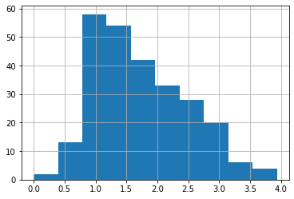
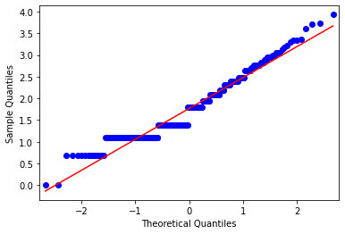

# Exemplar: Explore probability distributions

## **Introduction**

The ability to determine which type of probability distribution best fits data, calculate z-score, and detect outliers are essential skills in data work. These capabilities enable data professionals to understand how their data is distributed and identify data points that need further examination.

In this activity, you are a member of an analytics team for the United States Environmental Protection Agency (EPA). The data includes information about more than 200 sites, identified by state, county, city, and local site names. One of your main goals is to determine which regions need support to make air quality improvements. Given that carbon monoxide is a major air pollutant, you will investigate data from the Air Quality Index (AQI) with respect to carbon monoxide.

## **Step 1: Imports** 

Import relevant libraries, packages, and modules. For this lab, you will need `numpy`, `pandas`, `matplotlib.pyplot`, `statsmodels.api`, and `scipy`.


```python
# Import relevant libraries, packages, and modules.

### YOUR CODE HERE ###

import numpy as np
import pandas as pd
import matplotlib.pyplot as plt
import statsmodels.api as sm
from scipy import stats
```

A subset of data was taken from the air quality data collected by the EPA, then transformed to suit the purposes of this lab. This subset is a .csv file named `modified_c4_epa_air_quality.csv`. Load into a DataFrame.


```python
# Load data into a DataFrame and save in a variable.

### YOUR CODE HERE ###

data = pd.read_csv("modified_c4_epa_air_quality.csv")
```

<details><summary><h4><strong>Hint 1</strong></h4></summary>

Refer to what you learned about loading data in Python.
    
  
</details>

<details><summary><h4><strong>Hint 2</strong></h4></summary>

There is a function in the `pandas` library that allows you to load data from a .csv file into a DataFrame.
    
  
</details>

<details><summary><h4><strong>Hint 3</strong></h4></summary>

Use the `read_csv()` function and pass in the name of the csv file as a string.
    
</details>

## **Step 2: Data exploration** 

Display the first 10 rows of the data to get a sense of how the data is structured.


```python
# Display first 10 rows of the data.

### YOUR CODE HERE ###


data.head(10)
```


<div>
<style scoped>
    .dataframe tbody tr th:only-of-type {
        vertical-align: middle;
    }

    .dataframe tbody tr th {
        vertical-align: top;
    }

    .dataframe thead th {
        text-align: right;
    }
</style>
<table border="1" class="dataframe">
  <thead>
    <tr style="text-align: right;">
      <th></th>
      <th>date_local</th>
      <th>state_name</th>
      <th>county_name</th>
      <th>city_name</th>
      <th>local_site_name</th>
      <th>parameter_name</th>
      <th>units_of_measure</th>
      <th>aqi_log</th>
    </tr>
  </thead>
  <tbody>
    <tr>
      <th>0</th>
      <td>2018-01-01</td>
      <td>Arizona</td>
      <td>Maricopa</td>
      <td>Buckeye</td>
      <td>BUCKEYE</td>
      <td>Carbon monoxide</td>
      <td>Parts per million</td>
      <td>2.079442</td>
    </tr>
    <tr>
      <th>1</th>
      <td>2018-01-01</td>
      <td>Ohio</td>
      <td>Belmont</td>
      <td>Shadyside</td>
      <td>Shadyside</td>
      <td>Carbon monoxide</td>
      <td>Parts per million</td>
      <td>1.791759</td>
    </tr>
    <tr>
      <th>2</th>
      <td>2018-01-01</td>
      <td>Wyoming</td>
      <td>Teton</td>
      <td>Not in a city</td>
      <td>Yellowstone National Park - Old Faithful Snow ...</td>
      <td>Carbon monoxide</td>
      <td>Parts per million</td>
      <td>1.098612</td>
    </tr>
    <tr>
      <th>3</th>
      <td>2018-01-01</td>
      <td>Pennsylvania</td>
      <td>Philadelphia</td>
      <td>Philadelphia</td>
      <td>North East Waste (NEW)</td>
      <td>Carbon monoxide</td>
      <td>Parts per million</td>
      <td>1.386294</td>
    </tr>
    <tr>
      <th>4</th>
      <td>2018-01-01</td>
      <td>Iowa</td>
      <td>Polk</td>
      <td>Des Moines</td>
      <td>CARPENTER</td>
      <td>Carbon monoxide</td>
      <td>Parts per million</td>
      <td>1.386294</td>
    </tr>
    <tr>
      <th>5</th>
      <td>2018-01-01</td>
      <td>Hawaii</td>
      <td>Honolulu</td>
      <td>Not in a city</td>
      <td>Kapolei</td>
      <td>Carbon monoxide</td>
      <td>Parts per million</td>
      <td>2.708050</td>
    </tr>
    <tr>
      <th>6</th>
      <td>2018-01-01</td>
      <td>Hawaii</td>
      <td>Honolulu</td>
      <td>Not in a city</td>
      <td>Kapolei</td>
      <td>Carbon monoxide</td>
      <td>Parts per million</td>
      <td>1.098612</td>
    </tr>
    <tr>
      <th>7</th>
      <td>2018-01-01</td>
      <td>Pennsylvania</td>
      <td>Erie</td>
      <td>Erie</td>
      <td>NaN</td>
      <td>Carbon monoxide</td>
      <td>Parts per million</td>
      <td>1.098612</td>
    </tr>
    <tr>
      <th>8</th>
      <td>2018-01-01</td>
      <td>Hawaii</td>
      <td>Honolulu</td>
      <td>Honolulu</td>
      <td>Honolulu</td>
      <td>Carbon monoxide</td>
      <td>Parts per million</td>
      <td>1.791759</td>
    </tr>
    <tr>
      <th>9</th>
      <td>2018-01-01</td>
      <td>Colorado</td>
      <td>Larimer</td>
      <td>Fort Collins</td>
      <td>Fort Collins - CSU - S. Mason</td>
      <td>Carbon monoxide</td>
      <td>Parts per million</td>
      <td>1.945910</td>
    </tr>
  </tbody>
</table>
</div>


<details><summary><h4><strong>Hint 1</strong></h4></summary>

Refer to what you learned about exploring datasets in Python.
    
  
</details>

<details><summary><h4><strong>Hint 2</strong></h4></summary>

There is a function in the `pandas` library that allows you to display a specific number of rows from the top of a DataFrame.
    
  
</details>

<details><summary><h4><strong>Hint 3</strong></h4></summary>

Use the `head()` function and pass in how many rows from the top of the DataFrame you want to display.
    
</details>

The `aqi_log` column represents AQI readings that were transformed logarithmically to suit the objectives of this lab. 

To better understand the quantity of data you are working with, display the number of rows and the number of columns.


```python
# Display number of rows, number of columns.

### YOUR CODE HERE ###

data.shape
```


    (260, 8)


<details><summary><h4><strong>Hint 1</strong></h4></summary>

Refer to what you learned about exploring datasets in Python.
    
</details>

<details><summary><h4><strong>Hint 2</strong></h4></summary>

Every DataFrame in `pandas` has a property that gives you access to the number of rows and number of columns in that DataFrame.
  
</details>

<details><summary><h4><strong>Hint 3</strong></h4></summary>

Call the `shape` property of the DataFrame, which will display the number of rows and the number of columns as a tuple.
    
</details>

Now, you want to find out whether `aqi_log` fits a specific type of probability distribution. Create a histogram to visualize the distribution of `aqi_log`. Then, based on its shape, visually determine if it resembles a particular distribution.


```python
# Create a histogram to visualize distribution of aqi_log.

### YOUR CODE HERE ###

data["aqi_log"].hist();
```





<details><summary><h4><strong>Hint 1</strong></h4></summary>

Refer to the video about creating a histogram to visualize the distribution of a particular variable in the data.
    
  
</details>

<details><summary><h4><strong>Hint 2</strong></h4></summary>

There is a function in the `matplotlib` library that can be called to create a histogram.
    
  
</details>

<details><summary><h4><strong>Hint 3</strong></h4></summary>

The `hist()` function can be called directly on the `aqi_log` column from the data. 

A semicolon can be used at the end as a quick way to make sure only the plot gets displayed (other text does not get displayed).
    
</details>

**Question:** What do you observe about the shape of the distribution from the histogram? 

There is a slight right skew, but it still appears to be a bell shape. This shape suggests that the distribution of this data should be approximately normal.

Another way to visually check if the data is normally distributed is to create and inspect a QQ (quantile-quantile) plot.


```python
# Create QQ plot for aqi_log data.

### YOUR CODE HERE ###

fig = sm.qqplot(data["aqi_log"], line='s')
plt.show()
```





<details><summary><h4><strong>Hint 1</strong></h4></summary>

Refer to the video section about creating a QQ plot.
    
  
</details>

<details><summary><h4><strong>Hint 2</strong></h4></summary>

There is a function in the `statsmodels` library that can be called to create a QQ plot.
    
  
</details>

<details><summary><h4><strong>Hint 3</strong></h4></summary>

The `qqplot()` function from the `statsmodels` library can be called.

Make sure to pass in the `aqi_log` column from the data. 
    
</details>

**Question:** What do you observe about the QQ plot?  

In the QQ plot, most of the data points follow a straight line, which indicates that a normal distribution should fit the data. Only a few regions do not follow the line. 

## **Step 3: Statistical tests**

Use the empirical rule to observe the data, then test and verify that it is normally distributed.

 As you have learned, the empirical rule states that, for every normal distribution: 
- 68% of the data fall within 1 standard deviation of the mean
- 95% of the data fall within 2 standard deviations of the mean
- 99.7% of the data fall within 3 standard deviations of the mean


First, define two variables to store the mean and standard deviation, respectively, for `aqi_log`. Creating these variables will help you easily access these measures as you continue with the calculations involved in applying the empirical rule. 


```python
# Define variable for aqi_log mean.

### YOUR CODE HERE ###

mean_aqi_log = data["aqi_log"].mean()


# Print out the mean.

### YOUR CODE HERE ###

print(mean_aqi_log)
```

    1.7669210929985577


```python
# Define variable for aqi_log standard deviation.

### YOUR CODE HERE ###

std_aqi_log = data["aqi_log"].std()


# Print out the standard deviation.

### YOUR CODE HERE ###

print(std_aqi_log)
```

    0.7147155520223721


<details><summary><h4><strong>Hint 1</strong></h4></summary>

Refer to the lesson about calculating the mean and standard deviation for a particular variable in the data.
    
  
</details>

<details><summary><h4><strong>Hint 2</strong></h4></summary>

There are functions in the `numpy` library that can be called to calculate mean and standard deviation, respectively.
    
  
</details>

<details><summary><h4><strong>Hint 3</strong></h4></summary>

The `mean()` function can be called directly on the `aqi_log` column from the data to compute the mean.

The `std()` function can be called directly on the `aqi_log` column from the data to compute the standard deviation.
    
</details>

Now, check the first part of the empirical rule: whether 68% of the `aqi_log` data falls within 1 standard deviation of the mean.

To compute the actual percentage of the data that satisfies this criteria, define the lower limit (for example, 1 standard deviation below the mean) and the upper limit (for example, 1 standard deviation above the mean). This will enable you to create a range and confirm whether each value falls within it.


```python
# Define variable for lower limit, 1 standard deviation below the mean.

### YOUR CODE HERE ###

lower_limit = mean_aqi_log - 1 * std_aqi_log


# Define variable for upper limit, 1 standard deviation above the mean.

### YOUR CODE HERE ###

upper_limit = mean_aqi_log + 1 * std_aqi_log


# Display lower_limit, upper_limit.

### YOUR CODE HERE ###

print(lower_limit, upper_limit)
```

    1.0522055409761855 2.48163664502093


<details><summary><h4><strong>Hint 1</strong></h4></summary>

Refer to the video about using the empirical rule.
    
  
</details>

<details><summary><h4><strong>Hint 2</strong></h4></summary>

The lower limit here is $mean - 1 * std$.

The upper limit here is $mean + 1 * std$.

The `print` function can be called to display.
    
  
</details>

<details><summary><h4><strong>Hint 3</strong></h4></summary>

Use the variables that you defined for mean and standard deviation of `aqi_log`, ensuring the spelling is correct. 

Call the `print` function and pass in the values one after the other, with a comma between them.
    
</details>


```python
# Display the actual percentage of data that falls within 1 standard deviation of the mean.

### YOUR CODE HERE ### 

((data["aqi_log"] >= lower_limit) & (data["aqi_log"] <= upper_limit)).mean() * 100
```


    76.15384615384615


<details><summary><h4><strong>Hint 1</strong></h4></summary>

Refer to the video about using the empirical rule.
    
</details>

<details><summary><h4><strong>Hint 2</strong></h4></summary>

The `>=` operator can be used to confirm whether one value is greater than or equal to another value.

The `<=` operator can be used to check whether one value is less than or equal to another value.

The `&` operator can be used to check if one condition and another condition is met. 
    
</details>

<details><summary><h4><strong>Hint 3</strong></h4></summary>

The `mean()` function can be used to compute the proportion of the data that satisfies the specified conditions. 

Multiplying that proportion by $100$ can get you the percentage.
    
</details>

Now, consider the second part of the empirical rule: whether 95% of the `aqi_log` data falls within 2 standard deviations of the mean.

To compute the actual percentage of the data that satisfies this criteria, define the lower limit (for example, 2 standard deviations below the mean) and the upper limit (for example, 2 standard deviations above the mean). This will enable you to create a range and confirm whether each value falls within it.


```python
# Define variable for lower limit, 2 standard deviations below the mean.

### YOUR CODE HERE ###


lower_limit = mean_aqi_log - 2 * std_aqi_log


# Define variable for upper limit, 2 standard deviations below the mean.

### YOUR CODE HERE ###

upper_limit = mean_aqi_log + 2 * std_aqi_log


# Display lower_limit, upper_limit.

### YOUR CODE HERE ###

print(lower_limit, upper_limit)
```

    0.33748998895381344 3.1963521970433018


<details><summary><h4><strong>Hint 1</strong></h4></summary>

Refer to the video about using the empirical rule.
    
  
</details>

<details><summary><h4><strong>Hint 2</strong></h4></summary>

The lower limit here is $mean - 2 * std$.

The upper limit here is $mean + 2 * std$.

The `print` function can be called to display.
    
  
</details>

<details><summary><h4><strong>Hint 3</strong></h4></summary>

Use the variables that you defined for mean and standard deviation of `aqi_log`, ensuring the spelling is correct. 

Call the `print` function and pass in the values one after the other, with a comma between them.
    
</details>


```python
# Display the actual percentage of data that falls within 2 standard deviations of the mean.

### YOUR CODE HERE ### 

((data["aqi_log"] >= lower_limit) & (data["aqi_log"] <= upper_limit)).mean() * 100
```


    95.76923076923077


<details><summary><h4><strong>Hint 1</strong></h4></summary>

Refer to the video section about using the empirical rule.
    
</details>

<details><summary><h4><strong>Hint 2</strong></h4></summary>

The `>=` operator can be used to confirm whether one value is greater than or equal to another value.

The `<=` operator can be used to check whether one value is less than or equal to another value.

The `&` operator can be used to check if one condition and another condition is met. 
    
</details>

<details><summary><h4><strong>Hint 3</strong></h4></summary>

The `mean()` function can be used to compute the proportion of the data that satisfies the specified conditions. 

Multiplying that proportion by $100$ can get you the percentage.
    
</details>

Now, consider the third part of the empirical rule:whether 99.7% of the `aqi_log` data falls within 3 standard deviations of the mean.

To compute the actual percentage of the data that satisfies this criteria, define the lower limit (for example, 3 standard deviations below the mean) and the upper limit (for example, 3 standard deviations above the mean). This will enable you to create a range and confirm whether each value falls within it.


```python
# Define variable for lower limit, 3 standard deviations below the mean.

### YOUR CODE HERE ###

lower_limit = mean_aqi_log - 3 * std_aqi_log


# Define variable for upper limit, 3 standard deviations above the mean.

### YOUR CODE HERE ###

upper_limit = mean_aqi_log + 3 * std_aqi_log


# Display lower_limit, upper_limit.

### YOUR CODE HERE ###

print(lower_limit, upper_limit)
```

    -0.3772255630685586 3.911067749065674


<details><summary><h4><strong>Hint 1</strong></h4></summary>

Refer to the video about using the empirical rule.
    
  
</details>

<details><summary><h4><strong>Hint 2</strong></h4></summary>

The lower limit here is $mean - 3 * std$.

The upper limit here is $mean + 3 * std$.

The `print` function can be called to display.
    
  
</details>

<details><summary><h4><strong>Hint 3</strong></h4></summary>

Use the variables that you defined for mean and standard deviation of `aqi_log`, ensuring the spelling is correct. 

Call the `print` function and pass in the values one after the other, with a comma between them.
    
</details>


```python
# Display the actual percentage of data that falls within 3 standard deviations of the mean.

### YOUR CODE HERE ### 

((data["aqi_log"] >= lower_limit) & (data["aqi_log"] <= upper_limit)).mean() * 100
```


    99.61538461538461


<details><summary><h4><strong>Hint 1</strong></h4></summary>

Refer to the video about using the empirical rule.
    
</details>

<details><summary><h4><strong>Hint 2</strong></h4></summary>

The `>=` operator can be used to confirm whether one value is greater than or equal to another value.

The `<=` operator can be used to check whether one value is less than or equal to another value.

The `&` operator can be used to check if one condition and another condition is met. 
    
</details>

<details><summary><h4><strong>Hint 3</strong></h4></summary>

The `mean()` function can be used to compute the proportion of the data that satisfies the specified conditions. 

Multiplying that proportion by $100$ can get you the percentage.
    
</details>

## **Step 4: Results and evaluation** 

**Question:** What results did you attain by applying the empirical rule? 
- About 76.15% of the data falls within 1 standard deviation of the mean.
- About 95.77% of the data falls within 2 standard deviation of the mean.
- About 99.62% of the data falls within 3 standard deviations of the mean.

The 95.77% is very close to 95%, and the 99.62% is very close to 99.7%. The 76.15% is not as close to 68%, but relatively close. Overall, from applying the empirical rule, the data appears to be not exactly normal, but could be considered approximately normal. 

**Question:** How would you use z-score to find outliers?

Since z-score indicates the relative position of values (for instance, z-score measures how many standard deviations below or above the mean a data point is), it can be used to detect outliers.

Z-score could be used to identify values that lie more than 3 standard deviations below or above the mean. These values may be considered outliers.

Compute the z-score for every `aqi_log` value. Then, add a column named `z_score` in the data to store those results. 


```python
# Compute the z-score for every aqi_log value, and add a column named z_score in the data to store those results.

### YOUR CODE HERE ###

data["z_score"] = stats.zscore(data["aqi_log"])


# Display the first 5 rows to ensure that the new column was added.

### YOUR CODE HERE ###

data.head()
```


<div>
<style scoped>
    .dataframe tbody tr th:only-of-type {
        vertical-align: middle;
    }

    .dataframe tbody tr th {
        vertical-align: top;
    }

    .dataframe thead th {
        text-align: right;
    }
</style>
<table border="1" class="dataframe">
  <thead>
    <tr style="text-align: right;">
      <th></th>
      <th>date_local</th>
      <th>state_name</th>
      <th>county_name</th>
      <th>city_name</th>
      <th>local_site_name</th>
      <th>parameter_name</th>
      <th>units_of_measure</th>
      <th>aqi_log</th>
      <th>z_score</th>
    </tr>
  </thead>
  <tbody>
    <tr>
      <th>0</th>
      <td>2018-01-01</td>
      <td>Arizona</td>
      <td>Maricopa</td>
      <td>Buckeye</td>
      <td>BUCKEYE</td>
      <td>Carbon monoxide</td>
      <td>Parts per million</td>
      <td>2.079442</td>
      <td>0.438109</td>
    </tr>
    <tr>
      <th>1</th>
      <td>2018-01-01</td>
      <td>Ohio</td>
      <td>Belmont</td>
      <td>Shadyside</td>
      <td>Shadyside</td>
      <td>Carbon monoxide</td>
      <td>Parts per million</td>
      <td>1.791759</td>
      <td>0.034820</td>
    </tr>
    <tr>
      <th>2</th>
      <td>2018-01-01</td>
      <td>Wyoming</td>
      <td>Teton</td>
      <td>Not in a city</td>
      <td>Yellowstone National Park - Old Faithful Snow ...</td>
      <td>Carbon monoxide</td>
      <td>Parts per million</td>
      <td>1.098612</td>
      <td>-0.936873</td>
    </tr>
    <tr>
      <th>3</th>
      <td>2018-01-01</td>
      <td>Pennsylvania</td>
      <td>Philadelphia</td>
      <td>Philadelphia</td>
      <td>North East Waste (NEW)</td>
      <td>Carbon monoxide</td>
      <td>Parts per million</td>
      <td>1.386294</td>
      <td>-0.533584</td>
    </tr>
    <tr>
      <th>4</th>
      <td>2018-01-01</td>
      <td>Iowa</td>
      <td>Polk</td>
      <td>Des Moines</td>
      <td>CARPENTER</td>
      <td>Carbon monoxide</td>
      <td>Parts per million</td>
      <td>1.386294</td>
      <td>-0.533584</td>
    </tr>
  </tbody>
</table>
</div>


<details><summary><h4><strong>Hint 1</strong></h4></summary>

Refer to the video about calculating z-score.
    
</details>

<details><summary><h4><strong>Hint 2</strong></h4></summary>

There is a function in the `stats` module of the `scipy` library that you can call to calculate z-score.
    
</details>

<details><summary><h4><strong>Hint 3</strong></h4></summary>

Call the `zscore()` function and pass in the `aqi` column from the data.
    
</details>

Identify the parts of the data where `aqi_log` is above or below 3 standard deviations of the mean.


```python
# Display data where `aqi_log` is above or below 3 standard deviations of the mean

### YOUR CODE HERE ###

data[(data["z_score"] > 3) | (data["z_score"] < -3)]
```


<div>
<style scoped>
    .dataframe tbody tr th:only-of-type {
        vertical-align: middle;
    }

    .dataframe tbody tr th {
        vertical-align: top;
    }

    .dataframe thead th {
        text-align: right;
    }
</style>
<table border="1" class="dataframe">
  <thead>
    <tr style="text-align: right;">
      <th></th>
      <th>date_local</th>
      <th>state_name</th>
      <th>county_name</th>
      <th>city_name</th>
      <th>local_site_name</th>
      <th>parameter_name</th>
      <th>units_of_measure</th>
      <th>aqi_log</th>
      <th>z_score</th>
    </tr>
  </thead>
  <tbody>
    <tr>
      <th>244</th>
      <td>2018-01-01</td>
      <td>Arizona</td>
      <td>Maricopa</td>
      <td>Phoenix</td>
      <td>WEST PHOENIX</td>
      <td>Carbon monoxide</td>
      <td>Parts per million</td>
      <td>3.931826</td>
      <td>3.034886</td>
    </tr>
  </tbody>
</table>
</div>


<details><summary><h4><strong>Hint 1</strong></h4></summary>

Refer to the video about outlier detection.
    
</details>

<details><summary><h4><strong>Hint 2</strong></h4></summary>

The `>` operator can be used to evaluate whether one value is greater than another value. 

The `<` operator can be used to evaluate whether one value is less than another value. 

The `|` operator can used to evaluate whether one condition or another condition is met.  
    
</details>

<details><summary><h4><strong>Hint 3</strong></h4></summary>

To index the DataFrame, place a pair of parantheses around the evaluation of the two conditions and pass that into a pair of square brackets. This will allow you to get all rows in the data where the specified criteria is met.

Make sure the spelling of the column matches the name you specified when creating that column. 
    
</details>

**Question:** What do you observe about potential outliers based on the calculations?

The `aqi_log` for West Phoenix is slightly above 3 standard deviations of the mean. This means that the air quality at that site is worse than the rest of the sites represented in the data.

**Question:** Why is outlier detection an important part of this project? 

Detecting outliers is important because they can reveal two important things, depending on the context: First, they can identify measurements that were taken incorrectly. Second, they can highlight parts of the data that can be focused on to make improvements. 

For example, if the `aqi_log` for West Phoenix is considered an outlier, then that site can be studied further to determine what practices or changes might improve the air quality.

## **Considerations**

**What are some key takeaways that you learned during this lab?**

- Plotting the data using a histogram and a QQ plot, then observing the shape, enables you to visually determine whether the data is normally distributed.
- The empirical rule can be used to verify whether a distribution is normal.
- The mean and standard deviation are important measures when applying the empirical rule to a distribution.
- Z-score allows you to identify potenial outliers in the data.

**What summary would you provide to stakeholders? Consider the distribution of the data and which sites would benefit from additional research.**
- The distribution of the `aqi_log` data is approximately normal.
- Using statistical methods, it was determined that the site at West Phoenix has worse air quality than the other sites. 
- Consider allocating more resources toward further examining this site in order to improve its air quality.

**Reference**

US EPA, OAR. 2014, July 8. [Air Data: Air Quality Data Collected at Outdoor Monitors Across the US](https://www.epa.gov/outdoor-air-quality-data). 
