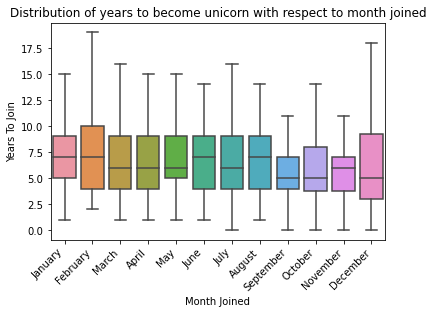
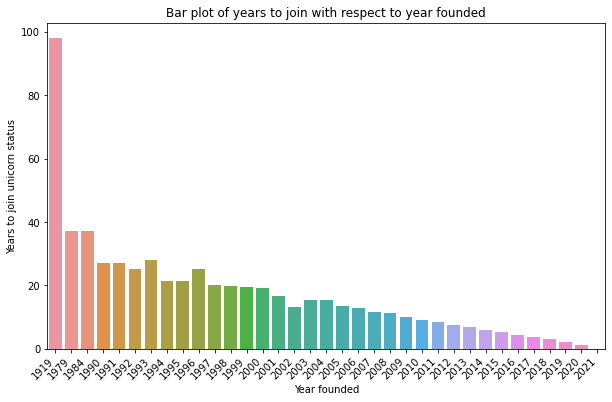
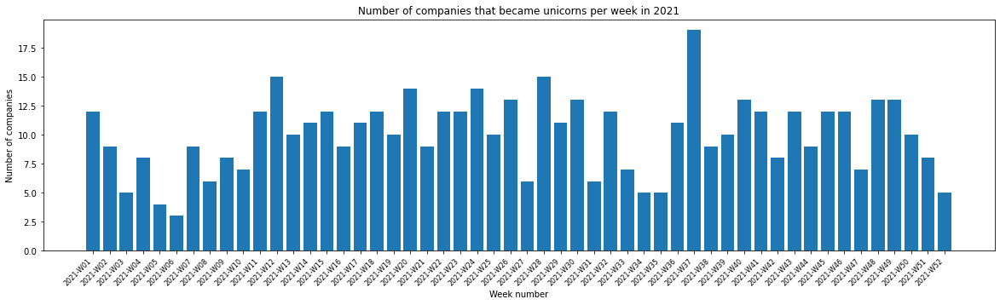
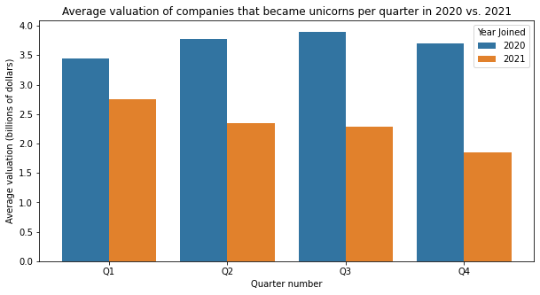

# Exemplar: Structure your data 

## Introduction

In this activity, you will practice structuring, an **exploratory data analysis (EDA)** step that helps data science projects move forward. During EDA, when working with data that contains aspects of date and time, "datetime" transformations are integral to better understanding the data. As a data professional, you will encounter datatime transformations quite often as you determine how to format your data to suit the problems you want to solve or the questions you want to answer. This activity gives you an opportunity to apply these skills and prepare you for future EDA, where you will need to determine how best to structure your data.

In this activity, you are a member of an analytics team that provides insights to an investing firm. To help them decide which companies to invest in next, the firm wants insights into **unicorn companies**–companies that are valued at over one billion dollars.  

You will work with a dataset about unicorn companies, discovering characteristics of the data, structuring the data in ways that will help you draw meaningful insights, and using visualizations to analyze the data. Ultimately, you will draw conclusions about what significant trends or patterns you find in the dataset. This will develop your skills in EDA and your knowledge of functions that allow you to structure data.


## Step 1: Imports

### Import relevant libraries and modules

Import the relevant Python libraries and modules that you will need to use. In this activity, you will use `pandas`, `numpy`, `seaborn`, and `matplotlib.pyplot`.


```python
# Import the relevant Python libraries and modules needed in this lab.

### YOUR CODE HERE ###

import pandas as pd
import numpy as np
import seaborn as sns
import matplotlib.pyplot as plt
```

### Load the dataset into a DataFrame

The dataset provided is in the form of a csv file named `Unicorn_Companies.csv` and contains a subset of data on unicorn companies. Load the dataset into a DataFrame. 


```python
# Load the dataset provided into a DataFrame.

### YOUR CODE HERE ###

companies = pd.read_csv("Unicorn_Companies.csv")
```

<details>
  <summary><h4><strong>Hint 1</strong></h4></summary>

Use the `read_csv()` function from `pandas` to read data from a csv file and load it into a DataFrame.

</details>

<details>
  <summary><h4><strong>Hint 2</strong></h4></summary>

Call `read_csv()` and pass in the name of the csv file as a string.
 
</details>

## Step 2: Data exploration


### Display the first 10 rows of the data

In this section, you will discover what the dataset entails and answer questions to guide your exploration and analysis of the data. This is an important step in EDA. 

To begin, display the first 10 rows of the data to get an understanding of how the dataset is structured. 


```python
# Display the first 10 rows of the data.

### YOUR CODE HERE

companies.head(10)
```


<div>
<style scoped>
    .dataframe tbody tr th:only-of-type {
        vertical-align: middle;
    }

    .dataframe tbody tr th {
        vertical-align: top;
    }

    .dataframe thead th {
        text-align: right;
    }
</style>
<table border="1" class="dataframe">
  <thead>
    <tr style="text-align: right;">
      <th></th>
      <th>Company</th>
      <th>Valuation</th>
      <th>Date Joined</th>
      <th>Industry</th>
      <th>City</th>
      <th>Country/Region</th>
      <th>Continent</th>
      <th>Year Founded</th>
      <th>Funding</th>
      <th>Select Investors</th>
    </tr>
  </thead>
  <tbody>
    <tr>
      <th>0</th>
      <td>Bytedance</td>
      <td>$180B</td>
      <td>4/7/17</td>
      <td>Artificial intelligence</td>
      <td>Beijing</td>
      <td>China</td>
      <td>Asia</td>
      <td>2012</td>
      <td>$8B</td>
      <td>Sequoia Capital China, SIG Asia Investments, S...</td>
    </tr>
    <tr>
      <th>1</th>
      <td>SpaceX</td>
      <td>$100B</td>
      <td>12/1/12</td>
      <td>Other</td>
      <td>Hawthorne</td>
      <td>United States</td>
      <td>North America</td>
      <td>2002</td>
      <td>$7B</td>
      <td>Founders Fund, Draper Fisher Jurvetson, Rothen...</td>
    </tr>
    <tr>
      <th>2</th>
      <td>SHEIN</td>
      <td>$100B</td>
      <td>7/3/18</td>
      <td>E-commerce &amp; direct-to-consumer</td>
      <td>Shenzhen</td>
      <td>China</td>
      <td>Asia</td>
      <td>2008</td>
      <td>$2B</td>
      <td>Tiger Global Management, Sequoia Capital China...</td>
    </tr>
    <tr>
      <th>3</th>
      <td>Stripe</td>
      <td>$95B</td>
      <td>1/23/14</td>
      <td>Fintech</td>
      <td>San Francisco</td>
      <td>United States</td>
      <td>North America</td>
      <td>2010</td>
      <td>$2B</td>
      <td>Khosla Ventures, LowercaseCapital, capitalG</td>
    </tr>
    <tr>
      <th>4</th>
      <td>Klarna</td>
      <td>$46B</td>
      <td>12/12/11</td>
      <td>Fintech</td>
      <td>Stockholm</td>
      <td>Sweden</td>
      <td>Europe</td>
      <td>2005</td>
      <td>$4B</td>
      <td>Institutional Venture Partners, Sequoia Capita...</td>
    </tr>
    <tr>
      <th>5</th>
      <td>Canva</td>
      <td>$40B</td>
      <td>1/8/18</td>
      <td>Internet software &amp; services</td>
      <td>Surry Hills</td>
      <td>Australia</td>
      <td>Oceania</td>
      <td>2012</td>
      <td>$572M</td>
      <td>Sequoia Capital China, Blackbird Ventures, Mat...</td>
    </tr>
    <tr>
      <th>6</th>
      <td>Checkout.com</td>
      <td>$40B</td>
      <td>5/2/19</td>
      <td>Fintech</td>
      <td>London</td>
      <td>United Kingdom</td>
      <td>Europe</td>
      <td>2012</td>
      <td>$2B</td>
      <td>Tiger Global Management, Insight Partners, DST...</td>
    </tr>
    <tr>
      <th>7</th>
      <td>Instacart</td>
      <td>$39B</td>
      <td>12/30/14</td>
      <td>Supply chain, logistics, &amp; delivery</td>
      <td>San Francisco</td>
      <td>United States</td>
      <td>North America</td>
      <td>2012</td>
      <td>$3B</td>
      <td>Khosla Ventures, Kleiner Perkins Caufield &amp; By...</td>
    </tr>
    <tr>
      <th>8</th>
      <td>JUUL Labs</td>
      <td>$38B</td>
      <td>12/20/17</td>
      <td>Consumer &amp; retail</td>
      <td>San Francisco</td>
      <td>United States</td>
      <td>North America</td>
      <td>2015</td>
      <td>$14B</td>
      <td>Tiger Global Management</td>
    </tr>
    <tr>
      <th>9</th>
      <td>Databricks</td>
      <td>$38B</td>
      <td>2/5/19</td>
      <td>Data management &amp; analytics</td>
      <td>San Francisco</td>
      <td>United States</td>
      <td>North America</td>
      <td>2013</td>
      <td>$3B</td>
      <td>Andreessen Horowitz, New Enterprise Associates...</td>
    </tr>
  </tbody>
</table>
</div>


<details>
  <summary><h4><strong>Hint 1</strong></h4></summary>

Refer to [the content about exploratory data analysis in Python](https://www.coursera.org/learn/go-beyond-the-numbers-translate-data-into-insight/lecture/kfl9b/find-stories-using-the-six-exploratory-data-analysis-practices).

</details>

<details>
  <summary><h4><strong>Hint 2</strong></h4></summary>

Use the function in the `pandas` library that allows you to get a specific number of rows from the top of a DataFrame.
 

</details>

<details>
  <summary><h4><strong>Hint 3</strong></h4></summary>

Call the `head()` function from the `pandas` library and pass in the number of rows you want from the top of the DataFrame.

</details>

### Identify the number of rows and columns

Identify the number of rows and columns in the dataset. This will help you get a sense of how much data you are working with.


```python
# Identify the number of rows and columns in the dataset.

### YOUR CODE HERE ###

companies.shape
```


    (1074, 10)


<details>
  <summary><h4><strong>Hint 1</strong></h4></summary>

Refer to [the content about exploratory data analysis in Python](https://www.coursera.org/learn/go-beyond-the-numbers-translate-data-into-insight/lecture/kfl9b/find-stories-using-the-six-exploratory-data-analysis-practices).

</details>

<details>
  <summary><h4><strong>Hint 2</strong></h4></summary>

Use the property that DataFrames in `pandas` have to display the number of rows and the number of columns as a tuple.

</details>

<details>
  <summary><h4><strong>Hint 3</strong></h4></summary>

The `shape` property that DataFrames have can help.

</details>

**Question:** What do you notice about the number of rows and columns in the dataset?

- There are 1074 rows and 10 columns in the dataset.
- According to this dataset, there are 1074 unicorn companies, as of March 2022. 
- This dataset shows 10 aspects of each company. 

### Check for duplicates in the data


```python
# Check for duplicates.

### YOUR CODE HERE ###

companies.drop_duplicates().shape
```


    (1074, 12)


<details>
  <summary><h4><strong>Hint 1</strong></h4></summary>

Refer to [the content about exploratory data analysis in Python](https://www.coursera.org/learn/go-beyond-the-numbers-translate-data-into-insight/lecture/kfl9b/find-stories-using-the-six-exploratory-data-analysis-practices).

</details>

<details>
  <summary><h4><strong>Hint 2</strong></h4></summary>

Use the function in `pandas` that can be called on a DataFrame to return the same DataFrame but with duplicates removed.

Use property that DataFrames in `pandas` have that to display the number of rows and columns as a tuple.
 
</details>

<details>
  <summary><h4><strong>Hint 3</strong></h4></summary>

Call the `drop_duplicates()` function on `companies`, followed by calling the `shape` property. 

Compare the shape that is returned from this to the original shape of `companies`, which you identified previously. 

</details>

**Question:** Based on the output above, are there any duplicates in the dataset?

- Since the shape that is returned after dropping duplicates is the same as the shape of the original DataFrame, you can infer that there are no duplicate values in the dataset. 

### Display the data types of the columns 

Knowing the data types of the columns is helpful because it indicates what types of analysis and aggregation can be done, how a column can be transformed to suit specific tasks, and so on. Display the data types of the columns. 


```python
# Display the data types of the columns.

### YOUR CODE HERE ###

companies.dtypes
```


    Company             object
    Valuation           object
    Date Joined         object
    Industry            object
    City                object
    Country/Region      object
    Continent           object
    Year Founded         int64
    Funding             object
    Select Investors    object
    dtype: object


<details>
  <summary><h4><strong>Hint 1</strong></h4></summary>

Refer to [the content about exploratory data analysis in Python](https://www.coursera.org/learn/go-beyond-the-numbers-translate-data-into-insight/lecture/kfl9b/find-stories-using-the-six-exploratory-data-analysis-practices).

</details>

<details>
  <summary><h4><strong>Hint 2</strong></h4></summary>

Use the property that DataFrames in `pandas` have to display the data types of the columns in the specified DataFrame.
 

</details>

<details>
  <summary><h4><strong>Hint 3</strong></h4></summary>

The `dtypes` property that DataFrames have can help.

</details>

**Question:** What do you notice about the data types of the columns in the dataset?

- The data type of the `Year Founded` column is `int64`. 
- The rest of the columns have the data type `object`.

**Question:** How would you sort this dataset in order to get insights about when the companies were founded?**

- Sort by `Year Founded`.
  - Sort by `Year Founded` in ascending order to arrange the data from companies that were founded the earliest to companies that were founded the latest.
  - Sort by `Year Founded` in descending order to arrange the data from companies that were founded the latest to companies that were founded the earliest.

### Sort the data

In this section, you will continue your exploratory data analysis by structuring the data. This is an important step in EDA, as it allows you to glean valuable and interesting insights about the data afterwards.

To begin, sort the data so that you can get insights about when the companies were founded. Consider whether it would make sense to sort in ascending or descending order based on what you would like to find.


```python
# Sort `companies` and display the first 10 rows of the resulting DataFrame.

### YOUR CODE HERE ###

# To arrange the data from latest to earliest `Year Founded`
companies.sort_values(by="Year Founded", ascending=False).head(10)

```


<div>
<style scoped>
    .dataframe tbody tr th:only-of-type {
        vertical-align: middle;
    }

    .dataframe tbody tr th {
        vertical-align: top;
    }

    .dataframe thead th {
        text-align: right;
    }
</style>
<table border="1" class="dataframe">
  <thead>
    <tr style="text-align: right;">
      <th></th>
      <th>Company</th>
      <th>Valuation</th>
      <th>Date Joined</th>
      <th>Industry</th>
      <th>City</th>
      <th>Country/Region</th>
      <th>Continent</th>
      <th>Year Founded</th>
      <th>Funding</th>
      <th>Select Investors</th>
    </tr>
  </thead>
  <tbody>
    <tr>
      <th>782</th>
      <td>Phantom</td>
      <td>$1B</td>
      <td>1/31/22</td>
      <td>Fintech</td>
      <td>San Francisco</td>
      <td>United States</td>
      <td>North America</td>
      <td>2021</td>
      <td>$118M</td>
      <td>Paradigm, Andreessen Horowitz, Jump Capital</td>
    </tr>
    <tr>
      <th>714</th>
      <td>Yidian Zixun</td>
      <td>$1B</td>
      <td>10/17/17</td>
      <td>Mobile &amp; telecommunications</td>
      <td>Beijing</td>
      <td>China</td>
      <td>Asia</td>
      <td>2021</td>
      <td>$151M</td>
      <td>Phoenix New Media, Tianjin Haihe Industry Fund</td>
    </tr>
    <tr>
      <th>822</th>
      <td>GlobalBees</td>
      <td>$1B</td>
      <td>12/28/21</td>
      <td>E-commerce &amp; direct-to-consumer</td>
      <td>New Delhi</td>
      <td>India</td>
      <td>Asia</td>
      <td>2021</td>
      <td>$185M</td>
      <td>Chiratae Ventures, SoftBank Group, Trifecta Ca...</td>
    </tr>
    <tr>
      <th>554</th>
      <td>ClickHouse</td>
      <td>$2B</td>
      <td>10/28/21</td>
      <td>Data management &amp; analytics</td>
      <td>Portola Valley</td>
      <td>United States</td>
      <td>North America</td>
      <td>2021</td>
      <td>$300M</td>
      <td>Lightspeed Venture Partners, Almaz Capital Par...</td>
    </tr>
    <tr>
      <th>952</th>
      <td>LayerZero Labs</td>
      <td>$1B</td>
      <td>3/30/22</td>
      <td>Internet software &amp; services</td>
      <td>New York</td>
      <td>United States</td>
      <td>North America</td>
      <td>2021</td>
      <td>$143M</td>
      <td>Andreessen Horowitz, FTX Ventures, Tiger Globa...</td>
    </tr>
    <tr>
      <th>314</th>
      <td>Flink Food</td>
      <td>$3B</td>
      <td>12/1/21</td>
      <td>E-commerce &amp; direct-to-consumer</td>
      <td>Berlin</td>
      <td>Germany</td>
      <td>Europe</td>
      <td>2021</td>
      <td>$1B</td>
      <td>Mubadala Capital, Bond, Prosus Ventures</td>
    </tr>
    <tr>
      <th>864</th>
      <td>Aptos</td>
      <td>$1B</td>
      <td>3/15/22</td>
      <td>Internet software &amp; services</td>
      <td>Palo Alto</td>
      <td>United States</td>
      <td>North America</td>
      <td>2021</td>
      <td>$200M</td>
      <td>Andreessen Horowitz, Coinbase Ventures, Tiger ...</td>
    </tr>
    <tr>
      <th>238</th>
      <td>Yuga Labs</td>
      <td>$4B</td>
      <td>3/22/22</td>
      <td>Fintech</td>
      <td>Miami</td>
      <td>United States</td>
      <td>North America</td>
      <td>2021</td>
      <td>$450M</td>
      <td>Andreessen Horowitz, Thrive Capital, Sound Ven...</td>
    </tr>
    <tr>
      <th>775</th>
      <td>Jokr</td>
      <td>$1B</td>
      <td>12/2/21</td>
      <td>E-commerce &amp; direct-to-consumer</td>
      <td>New York</td>
      <td>United States</td>
      <td>North America</td>
      <td>2021</td>
      <td>$430M</td>
      <td>GGV Capital, Tiger Global Management, Greycroft</td>
    </tr>
    <tr>
      <th>967</th>
      <td>Mensa Brands</td>
      <td>$1B</td>
      <td>11/16/21</td>
      <td>Other</td>
      <td>Bengaluru</td>
      <td>India</td>
      <td>Asia</td>
      <td>2021</td>
      <td>$218M</td>
      <td>Accel, Falcon Edge Capital, Norwest Venture Pa...</td>
    </tr>
  </tbody>
</table>
</div>


<details>
  <summary><h4><strong>Hint 1</strong></h4></summary>

Refer to [the content about exploratory data analysis in Python](https://www.coursera.org/learn/go-beyond-the-numbers-translate-data-into-insight/lecture/kfl9b/find-stories-using-the-six-exploratory-data-analysis-practices).

</details>

<details>
  <summary><h4><strong>Hint 2</strong></h4></summary>

Use the function in `pandas` that allows you to sort a DataFrame along a specific column.

</details>

<details>
  <summary><h4><strong>Hint 3</strong></h4></summary>

Use the `sort_values()` function, specifying the `by` parameter as the name of the column that you want to sort by and the `ascending` parameter as needed. Note that by default, `ascending` is set to `True`. If you want to sort in descending order, specify the `ascending` parameter as `False`.

</details>

**Question:** What do you observe from the sorting that you performed?

- If you sorted by `Year Founded` in descending order and displayed the first 10 rows of the resulting DataFrame, you might observe the following:
  - These 10 rows correspond to unicorn companies that were founded in 2021. 
  - These 10 companies were founded in different parts of the world and belong to different industries. 
  - Many of these 10 companies were founded in the United States and belong to "Fintech," "E-commerce & direct-to-consumer," and "Internet software & services" industries. 

**Question:** How would you find out how many companies in this dataset were founded each year?

- Use a function from the `pandas` library to get the count of each distinct value in the `Year Founded` column. Each count would indicate how many companies in the dataset were founded in the corresponding year.

### Determine the number of companies founded each year

Find out how many companies in this dataset were founded each year. Make sure to display each unique `Year Founded` that occurs in the dataset, and for each year, a number that represents how many companies were founded then.


```python
# Display each unique year that occurs in the dataset
# along with the number of companies that were founded in each unique year.

### YOUR CODE HERE ###

companies["Year Founded"].value_counts().sort_values(ascending=False)

```


    2015    155
    2016    110
    2014    109
    2012     95
    2013     87
    2011     82
    2017     74
    2018     61
    2019     45
    2010     40
    2009     34
    2008     27
    2020     25
    2007     24
    2006     15
    2005     14
    2000     11
    2021     11
    2001      9
    1999      8
    2004      8
    2003      8
    1998      5
    2002      4
    1994      2
    1995      2
    1992      1
    1993      1
    1990      1
    1984      1
    1996      1
    1979      1
    1991      1
    1919      1
    1997      1
    Name: Year Founded, dtype: int64


<details>
  <summary><h4><strong>Hint 1</strong></h4></summary>

Refer to [the content about exploratory data analysis in Python](https://www.coursera.org/learn/go-beyond-the-numbers-translate-data-into-insight/lecture/kfl9b/find-stories-using-the-six-exploratory-data-analysis-practices).

</details>

<details>
  <summary><h4><strong>Hint 2</strong></h4></summary>

Use the function in `pandas` that allows you to get the count for each distinct value in a specific column.

</details>

<details>
  <summary><h4><strong>Hint 3</strong></h4></summary>

Use the `value_counts()` function on the `Year Founded` column. 

</details>

**Question:** What do you observe from the counts of the unique `Year Founded` values in the dataset?

- `2015` has the highest count. This indicates that `2015` is the year when the largest number of companies in this dataset were founded.

**Question:** How would you transform the `Date Joined` column to gain more meaning from it?

- Given that the `Date Joined` columns currently has the data type `object`, if you wanted to compare when one company joined unicorn status to when another company joined, it would not be possible to achieve this meaningfully, as is. If this column were transformed so that it had a `datetime` data type instead, then it could be used to meaningfully compare `Date Joined` of one company to another. 

### Convert the `Date Joined` column to datetime

Convert the `Date Joined` column to datetime. This will split each value into year, month, and date components, allowing you to later gain insights about when a company gained unicorn status with respect to each component.


```python
# Convert `Date Joined` column to datetime.
# Update the column with the converted values.

### YOUR CODE HERE ###

companies["Date Joined"] = pd.to_datetime(companies["Date Joined"])


# Display the data types of the columns in `companies`
# to confirm that the update actually took place

### YOUR CODE HERE ###

companies.dtypes
```


    Company                     object
    Valuation                   object
    Date Joined         datetime64[ns]
    Industry                    object
    City                        object
    Country/Region              object
    Continent                   object
    Year Founded                 int64
    Funding                     object
    Select Investors            object
    dtype: object


<details>
  <summary><h4><strong>Hint 1</strong></h4></summary>

Refer to [the content about datetime transformations in Python](https://www.coursera.org/learn/go-beyond-the-numbers-translate-data-into-insight/supplement/ZcM4z/reference-guide-datetime-manipulation).

</details>

<details>
  <summary><h4><strong>Hint 2</strong></h4></summary>

Use the function in `pandas` that allows you to convert an object to datetime format.

Use the property that DataFrames have that can be used to display the data types of the columns.

</details>

<details>
  <summary><h4><strong>Hint 3</strong></h4></summary>

Use the `to_datetime()` function on the `Date Founded` column.

Make sure to update the column by reassigning to the result of the function call mentioned above.

Use the `dtypes` property to get the data types of the columns in `companies`.

</details>

**Question:** How would you obtain the names of the months when companies gained unicorn status?

- Now that the `Date Joined` column is in datetime format, extract the month name from each each value in `Date Joined`. This helps obtain the names of the months when companies attained unicorn status.

### Create a `Month Joined` column

Obtain the names of the months when companies gained unicorn status, and use the result to create a `Month Joined` column.


```python
# Obtain the names of the months when companies gained unicorn status.
# Use the result to create a `Month Joined` column.

### YOUR CODE HERE ###

companies["Month Joined"] = companies["Date Joined"].dt.month_name()


# Display the first few rows of `companies`
# to confirm that the new column did get added.

### YOUR CODE HERE ###

companies.head()
```


<div>
<style scoped>
    .dataframe tbody tr th:only-of-type {
        vertical-align: middle;
    }

    .dataframe tbody tr th {
        vertical-align: top;
    }

    .dataframe thead th {
        text-align: right;
    }
</style>
<table border="1" class="dataframe">
  <thead>
    <tr style="text-align: right;">
      <th></th>
      <th>Company</th>
      <th>Valuation</th>
      <th>Date Joined</th>
      <th>Industry</th>
      <th>City</th>
      <th>Country/Region</th>
      <th>Continent</th>
      <th>Year Founded</th>
      <th>Funding</th>
      <th>Select Investors</th>
      <th>Month Joined</th>
    </tr>
  </thead>
  <tbody>
    <tr>
      <th>0</th>
      <td>Bytedance</td>
      <td>$180B</td>
      <td>2017-04-07</td>
      <td>Artificial intelligence</td>
      <td>Beijing</td>
      <td>China</td>
      <td>Asia</td>
      <td>2012</td>
      <td>$8B</td>
      <td>Sequoia Capital China, SIG Asia Investments, S...</td>
      <td>April</td>
    </tr>
    <tr>
      <th>1</th>
      <td>SpaceX</td>
      <td>$100B</td>
      <td>2012-12-01</td>
      <td>Other</td>
      <td>Hawthorne</td>
      <td>United States</td>
      <td>North America</td>
      <td>2002</td>
      <td>$7B</td>
      <td>Founders Fund, Draper Fisher Jurvetson, Rothen...</td>
      <td>December</td>
    </tr>
    <tr>
      <th>2</th>
      <td>SHEIN</td>
      <td>$100B</td>
      <td>2018-07-03</td>
      <td>E-commerce &amp; direct-to-consumer</td>
      <td>Shenzhen</td>
      <td>China</td>
      <td>Asia</td>
      <td>2008</td>
      <td>$2B</td>
      <td>Tiger Global Management, Sequoia Capital China...</td>
      <td>July</td>
    </tr>
    <tr>
      <th>3</th>
      <td>Stripe</td>
      <td>$95B</td>
      <td>2014-01-23</td>
      <td>Fintech</td>
      <td>San Francisco</td>
      <td>United States</td>
      <td>North America</td>
      <td>2010</td>
      <td>$2B</td>
      <td>Khosla Ventures, LowercaseCapital, capitalG</td>
      <td>January</td>
    </tr>
    <tr>
      <th>4</th>
      <td>Klarna</td>
      <td>$46B</td>
      <td>2011-12-12</td>
      <td>Fintech</td>
      <td>Stockholm</td>
      <td>Sweden</td>
      <td>Europe</td>
      <td>2005</td>
      <td>$4B</td>
      <td>Institutional Venture Partners, Sequoia Capita...</td>
      <td>December</td>
    </tr>
  </tbody>
</table>
</div>


<details>
  <summary><h4><strong>Hint 1</strong></h4></summary>

Refer to [the content about extracting components from datetime objects in Python](https://www.coursera.org/learn/go-beyond-the-numbers-translate-data-into-insight/lecture/Vh13u/use-structuring-methods-to-establish-order-in-your-dataset).

</details>

<details>
  <summary><h4><strong>Hint 2</strong></h4></summary>

Use the function in the `pandas` library that contains datetime strings in order to extract the month names.

Use the function in the `pandas` library that allows you to display the first few rows of a DataFrame.

</details>

<details>
  <summary><h4><strong>Hint 3</strong></h4></summary>

Use the `dt.month_name()` function on the `Date Founded` column.

Use a pair of square brackets to create a new column. Make sure to specify the name of the new column inside the brackets and assign the column to the result of calling the function mentioned above.

Use the `head()` function to display the first few rows of a DataFrame.

</details>

**Question:** How would you determine how many years it took for companies to reach unicorn status?

- Given that the `Date Joined` column is in datetime format, extract the year component from `Date Joined` and subtract the `Year Founded` column from it. This difference in years represents how many it years it took for companies to reach unicorn status.

### Create a `Years To Join` column

Determine how many years it took for companies to reach unicorn status, and use the result to create a `Years To Join` column. Adding this to the dataset can help you answer questions you may have about this aspect of the companies.


```python
# Determine how many years it took for companies to reach unicorn status.
# Use the result to create a `Years To Join` column.

### YOUR CODE HERE ###

companies["Years To Join"] = companies["Date Joined"].dt.year - companies["Year Founded"]


# Display the first few rows of `companies`
# to confirm that the new column did get added.

### YOUR CODE HERE ###

companies.head()
```


<div>
<style scoped>
    .dataframe tbody tr th:only-of-type {
        vertical-align: middle;
    }

    .dataframe tbody tr th {
        vertical-align: top;
    }

    .dataframe thead th {
        text-align: right;
    }
</style>
<table border="1" class="dataframe">
  <thead>
    <tr style="text-align: right;">
      <th></th>
      <th>Company</th>
      <th>Valuation</th>
      <th>Date Joined</th>
      <th>Industry</th>
      <th>City</th>
      <th>Country/Region</th>
      <th>Continent</th>
      <th>Year Founded</th>
      <th>Funding</th>
      <th>Select Investors</th>
      <th>Month Joined</th>
      <th>Years To Join</th>
    </tr>
  </thead>
  <tbody>
    <tr>
      <th>0</th>
      <td>Bytedance</td>
      <td>$180B</td>
      <td>2017-04-07</td>
      <td>Artificial intelligence</td>
      <td>Beijing</td>
      <td>China</td>
      <td>Asia</td>
      <td>2012</td>
      <td>$8B</td>
      <td>Sequoia Capital China, SIG Asia Investments, S...</td>
      <td>April</td>
      <td>5</td>
    </tr>
    <tr>
      <th>1</th>
      <td>SpaceX</td>
      <td>$100B</td>
      <td>2012-12-01</td>
      <td>Other</td>
      <td>Hawthorne</td>
      <td>United States</td>
      <td>North America</td>
      <td>2002</td>
      <td>$7B</td>
      <td>Founders Fund, Draper Fisher Jurvetson, Rothen...</td>
      <td>December</td>
      <td>10</td>
    </tr>
    <tr>
      <th>2</th>
      <td>SHEIN</td>
      <td>$100B</td>
      <td>2018-07-03</td>
      <td>E-commerce &amp; direct-to-consumer</td>
      <td>Shenzhen</td>
      <td>China</td>
      <td>Asia</td>
      <td>2008</td>
      <td>$2B</td>
      <td>Tiger Global Management, Sequoia Capital China...</td>
      <td>July</td>
      <td>10</td>
    </tr>
    <tr>
      <th>3</th>
      <td>Stripe</td>
      <td>$95B</td>
      <td>2014-01-23</td>
      <td>Fintech</td>
      <td>San Francisco</td>
      <td>United States</td>
      <td>North America</td>
      <td>2010</td>
      <td>$2B</td>
      <td>Khosla Ventures, LowercaseCapital, capitalG</td>
      <td>January</td>
      <td>4</td>
    </tr>
    <tr>
      <th>4</th>
      <td>Klarna</td>
      <td>$46B</td>
      <td>2011-12-12</td>
      <td>Fintech</td>
      <td>Stockholm</td>
      <td>Sweden</td>
      <td>Europe</td>
      <td>2005</td>
      <td>$4B</td>
      <td>Institutional Venture Partners, Sequoia Capita...</td>
      <td>December</td>
      <td>6</td>
    </tr>
  </tbody>
</table>
</div>


<details>
  <summary><h4><strong>Hint 1</strong></h4></summary>

Refer to [the content about extracting components from datetime objects in Python](https://www.coursera.org/learn/go-beyond-the-numbers-translate-data-into-insight/lecture/Vh13u/use-structuring-methods-to-establish-order-in-your-dataset).

</details>

<details>
  <summary><h4><strong>Hint 2</strong></h4></summary>

Use the property in the `pandas` library that contains datetime strings in order to extract the year components.

Use the function in the `pandas` library that allows you to display the first few rows of a DataFrame.

</details>

<details>
  <summary><h4><strong>Hint 3</strong></h4></summary>

Use the `dt.year` property on the `Date Joined` column to obtain the years that companies became unicorns.

Obtain the arithmetic difference elementwise between two series in `pandas` by using the subtraction operator.  

Use a pair of square brackets to create a new column. Make sure to specify the name of the new column inside the brackets and assign the column to the result of calling the function mentioned above.

Use the `head()` function can to display the first few rows of a DataFrame.

</details>

**Question:** Which year would you like to gain more insight on with respect when companies attained unicorn status, and why?

- Get more insight on the year 2021, as that is the most recent year for which there is data available. Trends that took place in 2021 might be similar to trends that will take place in 2022. 

### Gain more insight on a specific year

To get more insight on the year of that interests you, filter the dataset by that year and save the resulting subset into a new variable. 


```python
# Filter dataset by a year of your interest (in terms of when companies reached unicorn status).
# Save the resulting subset in a new variable .

### YOUR CODE HERE ###

companies_2021 = companies[companies["Date Joined"].dt.year == 2021]


# Display the first few rows of the subset to confirm that it was created

### YOUR CODE HERE ###

companies_2021.head()
```


<div>
<style scoped>
    .dataframe tbody tr th:only-of-type {
        vertical-align: middle;
    }

    .dataframe tbody tr th {
        vertical-align: top;
    }

    .dataframe thead th {
        text-align: right;
    }
</style>
<table border="1" class="dataframe">
  <thead>
    <tr style="text-align: right;">
      <th></th>
      <th>Company</th>
      <th>Valuation</th>
      <th>Date Joined</th>
      <th>Industry</th>
      <th>City</th>
      <th>Country/Region</th>
      <th>Continent</th>
      <th>Year Founded</th>
      <th>Funding</th>
      <th>Select Investors</th>
      <th>Month Joined</th>
      <th>Years To Join</th>
    </tr>
  </thead>
  <tbody>
    <tr>
      <th>12</th>
      <td>FTX</td>
      <td>$32B</td>
      <td>2021-07-20</td>
      <td>Fintech</td>
      <td>NaN</td>
      <td>Bahamas</td>
      <td>North America</td>
      <td>2018</td>
      <td>$2B</td>
      <td>Sequoia Capital, Thoma Bravo, Softbank</td>
      <td>July</td>
      <td>3</td>
    </tr>
    <tr>
      <th>16</th>
      <td>J&amp;T Express</td>
      <td>$20B</td>
      <td>2021-04-07</td>
      <td>Supply chain, logistics, &amp; delivery</td>
      <td>Jakarta</td>
      <td>Indonesia</td>
      <td>Asia</td>
      <td>2015</td>
      <td>$5B</td>
      <td>Hillhouse Capital Management, Boyu Capital, Se...</td>
      <td>April</td>
      <td>6</td>
    </tr>
    <tr>
      <th>24</th>
      <td>Blockchain.com</td>
      <td>$14B</td>
      <td>2021-02-17</td>
      <td>Fintech</td>
      <td>London</td>
      <td>United Kingdom</td>
      <td>Europe</td>
      <td>2011</td>
      <td>$490M</td>
      <td>Lightspeed Venture Partners, Google Ventures, ...</td>
      <td>February</td>
      <td>10</td>
    </tr>
    <tr>
      <th>27</th>
      <td>OpenSea</td>
      <td>$13B</td>
      <td>2021-07-20</td>
      <td>E-commerce &amp; direct-to-consumer</td>
      <td>New York</td>
      <td>United States</td>
      <td>North America</td>
      <td>2017</td>
      <td>$427M</td>
      <td>Andreessen Horowitz, Thirty Five Ventures, Sou...</td>
      <td>July</td>
      <td>4</td>
    </tr>
    <tr>
      <th>34</th>
      <td>Getir</td>
      <td>$12B</td>
      <td>2021-03-26</td>
      <td>E-commerce &amp; direct-to-consumer</td>
      <td>Istanbul</td>
      <td>Turkey</td>
      <td>Europe</td>
      <td>2015</td>
      <td>$2B</td>
      <td>Tiger Global Management, Sequoia Capital, Revo...</td>
      <td>March</td>
      <td>6</td>
    </tr>
  </tbody>
</table>
</div>


<details>
  <summary><h4><strong>Hint 1</strong></h4></summary>

Refer to [the content about structuring data in Python](https://www.coursera.org/learn/go-beyond-the-numbers-translate-data-into-insight/lecture/Vh13u/use-structuring-methods-to-establish-order-in-your-dataset).

</details>

<details>
  <summary><h4><strong>Hint 2</strong></h4></summary>

Use the property in the `pandas` library that contains datetime strings in order to extract the year components.

Use square brackets to filter a DataFrame in order get a subset of the data. Make sure to specify an appropriate condition inside those brackets. The condition should convey which year you want to filter by. The rows that meet the condition are the rows that will be selected.

Use the function in the `pandas` library that allows you to display the first few rows of a DataFrame.

</details>

<details>
  <summary><h4><strong>Hint 3</strong></h4></summary>

Use the `dt.year` property on the `Date Joined` column to obtain the years that companies became unicorns.

Make sure to create a new variable and assign it to the subset. 

Use the `head()` function to display the first few rows of a DataFrame.

</details>

**Question:** What structuring approach would you take to observe trends over time in the companies that became unicorns in the year that interests you?

- First, identify a time interval of your choice. Then, take the subset that consists of the data for the year of interest, create a column that contains the time interval that each data point belongs to (as needed), group by that column, and count the number of companies that joined per interval. 
  - For example, if a subset consisted of companies that joined in 2021, create a column that corresponds to week joined, group by week, and count the number of companies that joined per week. This allows the observation of trends over the weeks of 2021. 

### Observe trends over time

Implement the structuring approach that you have identified to observe trends over time in the companies that became unicorns for the year that interests you.


```python
# After identifying the time interval that interests you, proceed with the following:
# Step 1. Take the subset that you defined for the year of interest. 
#         Insert a column that contains the time interval that each data point belongs to, as needed.
# Step 2. Group by the time interval.
#         Aggregate by counting companies that joined per interval of that year.
#         Save the resulting DataFrame in a new variable.

### YOUR CODE HERE ###

# Insert a `Week Joined` column into `companies_2021.`
companies_2021.insert(3, "Week Joined", companies_2021["Date Joined"].dt.strftime('%Y-W%V'), True)

# Group `companies_2021` by `Week Joined`. 
# Aggregate by counting companies that joined per week of 2021.
# Save the resulting DataFrame in a new variable.
companies_by_week_2021 = companies_2021.groupby(by="Week Joined")["Company"].count().reset_index().rename(columns={"Company":"Company Count"})

# Display the first few rows of the new DataFrame to confirm that it was created.

### YOUR CODE HERE ###

companies_by_week_2021.head()

```


<div>
<style scoped>
    .dataframe tbody tr th:only-of-type {
        vertical-align: middle;
    }

    .dataframe tbody tr th {
        vertical-align: top;
    }

    .dataframe thead th {
        text-align: right;
    }
</style>
<table border="1" class="dataframe">
  <thead>
    <tr style="text-align: right;">
      <th></th>
      <th>Week Joined</th>
      <th>Company Count</th>
    </tr>
  </thead>
  <tbody>
    <tr>
      <th>0</th>
      <td>2021-W01</td>
      <td>12</td>
    </tr>
    <tr>
      <th>1</th>
      <td>2021-W02</td>
      <td>9</td>
    </tr>
    <tr>
      <th>2</th>
      <td>2021-W03</td>
      <td>5</td>
    </tr>
    <tr>
      <th>3</th>
      <td>2021-W04</td>
      <td>8</td>
    </tr>
    <tr>
      <th>4</th>
      <td>2021-W05</td>
      <td>4</td>
    </tr>
  </tbody>
</table>
</div>


<details>
  <summary><h4><strong>Hint 1</strong></h4></summary>

Refer to [the content about structuring data in Python](https://www.coursera.org/learn/go-beyond-the-numbers-translate-data-into-insight/lecture/Vh13u/use-structuring-methods-to-establish-order-in-your-dataset).

</details>

<details>
  <summary><h4><strong>Hint 2</strong></h4></summary>

To obtain the data in a specific date format, call a function in the `pandas` library that contains datetime strings.

Use a pair of square brackets to add a new column to a DataFrame. Make sure to specify an appropriate column name inside the brackets.

Use a pair of square brackets to access a particular column from the result of grouping a DataFrame. 

Use these functions in the `pandas` library to achieve the following tasks:
- Group a DataFrame by a specific column
- Count the number of rows that belong to each group
- Reset the index so that the column that you grouped on also appears as a column after the grouping (instead of remaining an index) 
- Rename columns in a DataFrame
- Display the first few rows of a DataFrame

</details>

<details>
  <summary><h4><strong>Hint 3</strong></h4></summary>

Use `dt.strftime('%Y-W%V')` on the `Date Joined` column to obtain the weeks that companies became unicorns.

Use these functions in `pandas` to acheive the following tasks:
- `groupby()` to group a DataFrame by a specific column
- `count()` to count the number of rows that belong to each group
- `reset_index()` to reset the index so that the column that you grouped on also appears as a column after the grouping (instead of remaining an index) 
- `rename()` to rename the columns in a DataFrame
- `head()` to display the first few rows of a DataFrame

</details>

**Question:** How would you structure the data to observe trends over time in the average valuation of companies that joined in the year you expressed interest in earlier compared to another year?** 

- One approach consists of the following:
  - Identify which additional year you want to learn about.
  - Choose a time interval over which you want to observe average valuation.
  - Create a subset of data that corresponds to the additional year. Concatenate that subset with the previous subset you created, in order to get the data for both years in one DataFrame. 
  - Create a column that contains the time interval that each data point belongs to (as needed), group by that column, and compute the average funding of companies that joined per interval. 
- For example, to compare trends in average funding of companies quarterly between 2021 and 2020, if you already had a subset for 2021, you could do the following: 
- Create a subset for 2020.
- Concatenate that with the subset for 2020.
- Create a column that corresponds to quarter joined.
- Group by quarter.
- Compute the average valuation of companies that joined per quarter. 

This allows the observation of trends over the quarters of 2020 compared to 2021. 

### Compare trends over time

Implement the structuring approach that you have identified in order to compare trends over time in the average funding of companies that became unicorns between your years of interest. Keep in mind the data type of the `Valuation` column and what the values in that column contain currently


```python
# After identifying the additional year and time interval of interest, proceed with the following:
# Step 1. Filter by the additional year to create a subset that consists of companies that joined in that year.
# Step 2. Concatenate that new subset with the subset that you defined previously.
# Step 3. As needed, add a column that contains the time interval that each data point belongs to, 
#         in the concatenated DataFrame.
# Step 4. Transform the `Valuation` column as needed.
# Step 5. Group by the time interval.
#         Aggregate by computing average funding of companies that joined per interval of the corresponding year.
#         Save the resulting DataFrame in a new variable.

### YOUR CODE HERE ###

# Filter by the additional year to create a subset that consists of companies that joined in that year.
companies_2020 = companies[companies["Date Joined"].dt.year == 2020]

# Concatenate the new subset with the subset that you defined previously.
companies_2020_2021 = pd.concat([companies_2020, companies_2021.drop(columns="Week Joined")])

# Add `Quarter Joined` column to `companies_2021`.
companies_2020_2021["Quarter Joined"] = companies_2020_2021["Date Joined"].dt.to_period('Q').dt.strftime('%Y-Q%q')

# Convert the `Valuation` column to numeric by removing `$` and `B` and casting each value to data type `float`.
companies_2020_2021["Valuation"] =  companies_2020_2021["Valuation"].apply(lambda v: v.strip("$B")).astype(float)

# Group `companies_2020_2021` by `Quarter Joined`, 
# Aggregate by computing average `Funding` of companies that joined per quarter of each year.
# Save the resulting DataFrame in a new variable.
companies_by_quarter_2020_2021 = companies_2020_2021.groupby(by="Quarter Joined")["Valuation"].mean().reset_index().rename(columns={"Valuation":"Average Valuation"})

# Display the first few rows of the new DataFrame to confirm that it was created.

### YOUR CODE HERE ###

companies_by_quarter_2020_2021.head()

```


<div>
<style scoped>
    .dataframe tbody tr th:only-of-type {
        vertical-align: middle;
    }

    .dataframe tbody tr th {
        vertical-align: top;
    }

    .dataframe thead th {
        text-align: right;
    }
</style>
<table border="1" class="dataframe">
  <thead>
    <tr style="text-align: right;">
      <th></th>
      <th>Quarter Joined</th>
      <th>Average Valuation</th>
    </tr>
  </thead>
  <tbody>
    <tr>
      <th>0</th>
      <td>2020-Q1</td>
      <td>3.444444</td>
    </tr>
    <tr>
      <th>1</th>
      <td>2020-Q2</td>
      <td>3.777778</td>
    </tr>
    <tr>
      <th>2</th>
      <td>2020-Q3</td>
      <td>3.896552</td>
    </tr>
    <tr>
      <th>3</th>
      <td>2020-Q4</td>
      <td>3.697674</td>
    </tr>
    <tr>
      <th>4</th>
      <td>2021-Q1</td>
      <td>2.750000</td>
    </tr>
  </tbody>
</table>
</div>


<details>
  <summary><h4><strong>Hint 1</strong></h4></summary>

Refer to [the content about manipulating data in Python](https://www.coursera.org/learn/go-beyond-the-numbers-translate-data-into-insight/lecture/0GjvK/date-string-manipulations-with-python).

</details>

<details>
  <summary><h4><strong>Hint 2</strong></h4></summary>

To obtain the data in a specific periodic datetime format, call a function in the `pandas` library that contains datetime strings.   

Keep in mind that currently, the `Valuation` column is of data type `object` and contains `$` and `B` to indicate that each amount is in billions of dollars.

Call functions in the `pandas` library on a series to achieve the following tasks:
  - Apply a function to each value in the series.
  - Cast each value in the series to a specified data type.

Use a pair of square brackets to access a particular column from the result of grouping a DataFrame. 

These functions in the `pandas` library can help achieve the following tasks:
- Concatenate two DataFrames together
- Drop columns that you do not need from a DataFrame
- Group a DataFrame by a specific column
- Compute the average value for each group
- Reset the index so that the column that you grouped on also appears as a column after the grouping (instead of remaining an index) 
- Rename columns in a DataFrame
- Display the first few rows of a DataFrame

</details>

<details>
  <summary><h4><strong>Hint 3</strong></h4></summary>

Use `.dt.to_period('Q').dt.strftime('%Y-Q%q')` on the `Date Joined` column to obtain the quarters during which companies became unicorns.

Call `apply(lambda v: v.strip("$B"))` on the `Valuation` column to remove the `$` and `B` from each value.

Use the following functions in `pandas` to acheive the following tasks:
- `concat` to concatenate two DataFrames together (note: this function takes in a list of DataFrames and returns a DataFrame that contains all rows from both inputs)
- `drop()` to drop columns that you do not need from a DataFrame
- `groupby()` to group a DataFrame by a specific column
- `mean()` to compute the average value for each group
- `reset_index()` to reset the index so that the column that you grouped on also appears as a column after the grouping (instead of remaining an index) 
- `rename()` to rename the columns in a DataFrame
- `head()` to display the first few rows of a DataFrame

</details>

## Step 3: Statistical tests

### Visualize the time it took companies to become unicorns

As a next step, visualize your data. Using the `companies` dataset, create a box plot to visualize the distribution of how long it took companies to become unicorns, with respect to the month they joined. 


```python
# Define a list that contains months in chronological order.

### YOUR CODE HERE ###

month_order = ["January", "February", "March", "April", "May", "June",
               "July", "August", "September", "October", "November", 
               "December"]

# Print out the list to confirm it is correct.

### YOUR CODE HERE ###

print(month_order)
            
```

    ['January', 'February', 'March', 'April', 'May', 'June', 'July', 'August', 'September', 'October', 'November', 'December']


```python
# Create the box plot 
# to visualize the distribution of how long it took companies to become unicorns, 
# with respect to the month they joined.
# Make sure the x-axis goes in chronological order by month, using the list you defined above.
# Plot the data from the `companies` DataFrame.

### YOUR CODE HERE ###

sns.boxplot(x=companies['Month Joined'], 
            y=companies['Years To Join'], 
            order=month_order, 
            showfliers=False)

# Set the title of the plot.

### YOUR CODE HERE ###

plt.title('Distribution of years to become unicorn with respect to month joined')

# Rotate labels on the x-axis as a way to avoid overlap in the positions of the text. 

### YOUR CODE HERE ###

plt.xticks(rotation=45, horizontalalignment='right')

# Display the plot.

### YOUR CODE HERE ###

plt.show()

```





<details>
  <summary><h4><strong>Hint 1</strong></h4></summary>

Refer to [the content about creating a box plot](https://www.coursera.org/learn/go-beyond-the-numbers-translate-data-into-insight/lecture/Pf6KW/eda-structuring-with-python).

</details>

<details>
  <summary><h4><strong>Hint 2</strong></h4></summary>

Use the function in the `seaborn` library that allows you to create a box plot.

Use the functions in the `matplotlib.pyplot` module that allow you to acheive the following tasks:
- set the title of a plot
- rotate labels on the x-axis of a plot
- display a plot

</details>

<details>
  <summary><h4><strong>Hint 3</strong></h4></summary>

Use the `boxplot()` function from `seaborn` to create a box plot, passing in the parameters `x`, `y`, `order`, and `showfliers`. To keep outliers from appearing on the box plot, set `showfliers` to `False`.

Use following functions to achieve the following tasks:
- `plt.title()` to set the title of a plot
- `plt.xticks()` to rotate labels on the x-axis of a plot
- pass in the parameters `rotation=45, horizontalalignment='right'`to rotate the labels by 45 degrees and align the labels to the right
- `plt.show()` to display a plot

</details>

 **Question:** What do you observe from the boxplot above?
 
- From the box plot above, the median value for `Years To Join` is different for each month. Also, the median `Years To Join` is lower for the months of September and October. This could indicate that companies that reached unicorn status in early fall took less time to reach $1 billion valuation. This is because the number of companies is relatively close/consistent for each month. If that were not the case, it would be misleading to compare the median values from the box plots between months.

## Step 4: Results and evaluation


### Visualize the time it took companies to reach unicorn status

In this section, you will evaluate the result of structuring the data, making observations, and gaining further insights about the data. 

Using the `companies` dataset, create a bar plot to visualize the average number of years it took companies to reach unicorn status with respect to when they were founded. 


```python
# Set the size of the plot.

### YOUR CODE HERE ###

plt.figure(figsize=(10,6))


# Create bar plot to visualize the average number of years it took companies to reach unicorn status 
# with respect to when they were founded.
# Plot data from the `companies` DataFrame.

### YOUR CODE HERE ###

sns.barplot(x=companies["Year Founded"], y=companies["Years To Join"], ci=False)


# Set title

### YOUR CODE HERE ###

plt.title("Bar plot of years to join with respect to year founded")


# Set x-axis label

### YOUR CODE HERE ###

plt.xlabel("Year founded")


# Set y-axis label

### YOUR CODE HERE ###

plt.ylabel("Years to join unicorn status")


# Rotate the labels on the x-axis as a way to avoid overlap in the positions of the text.  

### YOUR CODE HERE ###

plt.xticks(rotation=45, horizontalalignment='right')

# Display the plot.

### YOUR CODE HERE ###

plt.show()
```





<details>
  <summary><h4><strong>Hint 1</strong></h4></summary>

Refer to [the content about creating a bar plot](https://www.coursera.org/learn/go-beyond-the-numbers-translate-data-into-insight/lecture/0GjvK/date-string-manipulations-with-python).

</details>

<details>
  <summary><h4><strong>Hint 2</strong></h4></summary>

Use the function in the `seaborn` library that allows you to create a bar plot where the height of each bar is the average value for the corresponding category, by default.

Use the functions in the `matplotlib.pyplot` module that allow you to set the size, title, x-axis label, and y-axis label of plots. In that module, there are also functions for rotating the labels on the x-axis and displaying the plot. 

</details>

<details>
  <summary><h4><strong>Hint 3</strong></h4></summary>

Use the `barplot()` function from `seaborn`, passing in the parameters `x`, `y`, and `ci`. To keep confidence interval lines from appearing on the bar plot,  set `ci` to `False`.

Use `plt.figure()`, passing in the `figsize` parameter to set the size of a plot.

Use `plt.title()`, `plt.xlabel()`, `plt.ylabel()` to set the title, x-axis label, and y-axis label, respectively. 

Use `plt.xticks()` to rotate labels on the x-axis of a plot. Paass in the parameters `rotation=45, horizontalalignment='right'` to rotate the labels by 45 degrees and align the labels to the right.

Use `plt.show()` to display a plot.

</details>

**Question:** What do you observe from the bar plot of years to join with respect to the year founded?

- There appears to be a trend wherein companies that were founded later took less time to reach unicorn status, on average. This is biased—a bias that is common in time data—because companies founded in later years have been around for less time. Therefore, there is less time to collect data on such companies compared to companies founded in earlier years). 


### Visualize the number of companies that joined per interval 

Using the subset of companies joined in the year of interest, grouped by the time interval of your choice, create a bar plot to visualize the number of companies that joined per interval for that year.


```python
# Set the size of the plot.

### YOUR CODE HERE ###

plt.figure(figsize = (20, 5))

# Create bar plot to visualize number of companies that joined per interval for the year of interest.

### YOUR CODE HERE ###

plt.bar(x=companies_by_week_2021['Week Joined'],height=companies_by_week_2021['Company Count'])
plt.plot()

# Set the x-axis label.

### YOUR CODE HERE ###

plt.xlabel("Week number")

# Set the y-axis label.

### YOUR CODE HERE ###

plt.ylabel("Number of companies")

# Set the title.

### YOUR CODE HERE ###

plt.title("Number of companies that became unicorns per week in 2021")

# Rotate the labels on the x-axis as a way to avoid overlap in the positions of the text.  

### YOUR CODE HERE ###

plt.xticks(rotation = 45, horizontalalignment='right', fontsize=8)

# Display the plot.

### YOUR CODE HERE ###

plt.show()
```





<details>
  <summary><h4><strong>Hint 1</strong></h4></summary>

Refer to [the content about creating a bar plot](https://www.coursera.org/learn/go-beyond-the-numbers-translate-data-into-insight/lecture/0GjvK/date-string-manipulations-with-python).

</details>

<details>
  <summary><h4><strong>Hint 2</strong></h4></summary>

Use the function in the `seaborn` library that allows you to create a bar plot where the height of each bar is the average value for the corresponding category, by default.

Use the functions in the `matplotlib.pyplot` module that allow you to set the size, title, x-axis label, and y-axis label of plots. In that module, there are also functions for rotating the labels on the x-axis and displaying the plot. 

</details>

<details>
  <summary><h4><strong>Hint 3</strong></h4></summary>

Use the `barplot()` function from `seaborn`, passing in the parameters `x`, `y`, and `ci`. To keep confidence interval lines from appearing on the bar plot,  set `ci` to `False`.

Use `plt.figure()`, passing in the `figsize` parameter to set the size of a plot.

Use `plt.title()`, `plt.xlabel()`, `plt.ylabel()` to set the title, x-axis label, and y-axis label, respectively. 

Use `plt.xticks()` to rotate labels on the x-axis of a plot. Paass in the parameters `rotation=45, horizontalalignment='right'` to rotate the labels by 45 degrees and align the labels to the right.

Use `plt.show()` to display a plot.

</details>

**Question:** What do you observe from the bar plot of the number of companies that joined per interval for the year of interest?

- Observations from a bar plot of the number of companies that became unicorns per week in 2021:

  - The number of companies that joined unicorn status fluctuated over the weeks of 2021, with a trend of decline followed by increase occurring periodically.
  - The highest number of companies reached $1 billion valuation in Week 37 of 2021, which corresponds to the third week of September 2021. 
  - The weeks in 2021 with the next highest number of companies becoming unicorns are Week 12 (which corresponds to the fourth week of March) and Week 28 (which corresponds to the third week of July). 
  

### Visualize the average valuation over the quarters

Using the subset of companies that joined in the years of interest, create a grouped bar plot to visualize the average valuation over the quarters, with two bars for each time interval. There will be two bars for each time interval. This allows you to compare quarterly values between the two years.


```python
# Using slicing, extract the year component and the time interval that you specified, 
# and save them by adding two new columns into the subset. 

### YOUR CODE HERE ###

companies_by_quarter_2020_2021['Quarter Number'] = companies_by_quarter_2020_2021['Quarter Joined'].str[-2:]
companies_by_quarter_2020_2021['Year Joined'] = companies_by_quarter_2020_2021['Quarter Joined'].str[:4]

# Set the size of the plot.

### YOUR CODE HERE ###

plt.figure(figsize = (10, 5))

# Create a grouped bar plot.

### YOUR CODE HERE ###

sns.barplot(x=companies_by_quarter_2020_2021['Quarter Number'],
            y=companies_by_quarter_2020_2021['Average Valuation'],
            hue=companies_by_quarter_2020_2021['Year Joined'])
plt.plot()

# Set the x-axis label.

### YOUR CODE HERE ###

plt.xlabel("Quarter number")

# Set the y-axis label.

### YOUR CODE HERE ###

plt.ylabel("Average valuation (billions of dollars)")

# Set the title.

### YOUR CODE HERE ###

plt.title("Average valuation of companies that became unicorns per quarter in 2020 vs. 2021")

# Display the plot.

### YOUR CODE HERE ###

plt.show()
```





<details>
  <summary><h4><strong>Hint 1</strong></h4></summary>

Refer to [the content about creating a grouped bar plot](https://www.coursera.org/learn/go-beyond-the-numbers-translate-data-into-insight/lecture/Pf6KW/eda-structuring-with-python).

</details>

<details>
  <summary><h4><strong>Hint 2</strong></h4></summary>

Use the function in the `seaborn` library that allows you to create a grouped bar plot, specifying the category and height for each bar, as well as the hue.

Use the functions in the `matplotlib.pyplot` module that allow you to set the size, title, x-axis label, and y-axis label of plots. In that module, there is also a function for displaying the plot. 

</details>

<details>
  <summary><h4><strong>Hint 3</strong></h4></summary>

Use the `plt.bar()` to create the bar plot, passing in the parameters `x`, `y`, and `hue`. For the task at hand, set `hue` to the column that contains year joined. 

Use `plt.figure()`, passing in the `figsize` parameter to set the size of a plot.

Use `plt.title()`, `plt.xlabel()`, `plt.ylabel()` to set the title, x-axis label, and y-axis label, respectively. 

Use `plt.show()` to display a plot.

</details>

**Question:** What do you observe from the grouped bar plot above?

- Observations from a grouped bar plot of average valuation of companies that became unicorns per quarter in 2020 vs. 2021:

  - In each quarter, the average valuation of companies that joined unicorn status was higher in 2020 than in 2021. 
  - In 2020, Q3 was the quarter with the highest average valuation of companies that reached unicorn status, and there was a trend of increase from Q1 to Q2 and from Q2 to Q3. 
  - In 2021, Q1 was the quarter with the highest average valuation of companies that reached unicorn status, and there was a trend of decrease across the quarters.
  

**Question:** Is there any bias in the data that could potentially inform your analysis?

- Potential bias:

  - If there were bias in terms of which cities and countries were taken into account when collecting the data, then the analysis would be more representative of the cities and countries that are in the dataset than those that are not.
  - If the dataset did not include certain industries, then the analysis would be more representative of the industries that are included and may not reflect trends in those that are excluded from the data. 
  - If the dataset had time gaps, (e.g., if companies that joined in certain windows of time were not included in the data), then that may have affected the patterns observed, depending on how salient the gaps were.
  - Another point of bias pertains to the nature of time data; there have been fewer years to collect data on companies that were founded more recently than for companies that were founded longer ago.

**Question:** What potential next steps could you take with your EDA?
 
- Potential next steps with EDA: 

  - Analyze the data with respect to industries of unicorn companies at different datetime intervals.
  - Analyze the data with respect to cities or countries where unicorn companies were founded at different datetime intervals.
  - Clean the data as needed.

**Question:** Are there any unanswered questions you have about the data? If yes, what are they?

- Possible questions:

  - How many rounds of funding did each company require and when did this funding take place?
  - Have any of these unicorn companies acquired other companies along the way? If so, which companies acquired other companies, which companies did they acquire, and when did the acquisitions take place?

## Considerations

**What are some key takeaways that you learned from this lab?**

- Functions in the `pandas` library can be used for data manipulation in order to reorganize and structure the data.
- Converting strings that contain dates to datetime format allow you to extract individual components from the data, such as month and year.
- Structuring the data in specific ways allows you to observe more trends and zoom in on parts of the data that are interesting to you.
- Functions in the `matplotlib.pyplot` module and the `seaborn` library can be used to create visualizations to gain further insight after structuring the data.

**What findings would you share with others?**

- There are 1074 unicorn companies represented in this dataset.
- 2015 is the year when the most number of unicorn companies were founded. 
- Many of the unicorn companies that were founded in 2021 were founded in the United States and belong to "Fintech", "E-commerce & direct-to-consumer", and "Internet software & services" industries. 
- The box plot created shows that companies that become unicorns in the months of September and October have a smaller median value for how long it took to become unicorns.
- One of the bar plots created shows that the average valuation of companies that joined in 2020 is highest in the third quarter of the year, whereas the average valuation of companies that joined in 2021 is highest in the first quarter of the year.

**What recommendations would you share with stakeholders based on these findings?**

- According to data analysis that was conducted on a dataset of 1074 unicorn companies, companies that joined in the months of September and October tended to take less time to become unicorns.
- Another finding was that many of the unicorn companies that were founded in 2021 were founded in the United States and belong to "Fintech", "E-commerce & direct-to-consumer", and "Internet software & services" industries. So if the stakeholders want to invest in companies founded in 2021, it would be a good idea to consider companies that belong to these industries, as they may be strong candidates for becoming unicorns.
- It was also discovered that the average valuation of companies that joined in 2021 is highest in the first quarter of the year, and the average valuation of companies that joined in 2020 is the third quarter of the year. When considering companies that newly join in the future, it would be worth closely looking at companies that join in the first and third quarters of the year. 
- The data can be analyzed further to gather more insights that are specific to the interests of the investing firm and the stakeholders. 

**References**

Bhat, M.A. (2022, March).[*Unicorn Companies*](https://www.kaggle.com/datasets/mysarahmadbhat/unicorn-companies). 

