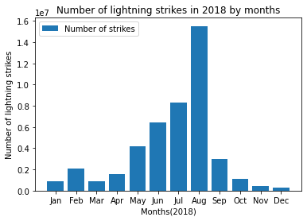

# Discovering

Throughout the following exercises, you will implement discovering skills on a dataset. Before starting on this programming exercise, we strongly recommend watching the video lecture and completing the IVQ for the associated topics. 

All the information you need for solving this assignment is in this notebook, and all the code you will be implementing will take place within this notebook.

As we move forward, you can find instructions on how to install required libraries as they arise in this notebook. Before we begin with the exercises and analyzing the data, we need to import all libraries and extensions required for this programming exercise. Throughout the course, we will be using pandas, numpy, datetime, for operations, and matplotlib, pyplot and seaborn for plotting.

## Objective

First, we will use pandas to examine 2018 lightning strike data collected by the National Oceanic and Atmospheric Administration (NOAA). Then, we will calculate the total number of strikes for each month, and plot this information on a bar graph.

Begin with importing the following packages and libraries:


```python
import pandas as pd
import numpy as np
import datetime
import matplotlib.pyplot as plt
```


```python
# Read in the 2018 lightning strike dataset
df = pd.read_csv('eda_using_basic_data_functions_in_python_dataset1.csv')
```


```python
# Inspect the first 10 rows
df.head(10)
```


<div>
<style scoped>
    .dataframe tbody tr th:only-of-type {
        vertical-align: middle;
    }

    .dataframe tbody tr th {
        vertical-align: top;
    }

    .dataframe thead th {
        text-align: right;
    }
</style>
<table border="1" class="dataframe">
  <thead>
    <tr style="text-align: right;">
      <th></th>
      <th>date</th>
      <th>number_of_strikes</th>
      <th>center_point_geom</th>
    </tr>
  </thead>
  <tbody>
    <tr>
      <th>0</th>
      <td>2018-01-03</td>
      <td>194</td>
      <td>POINT(-75 27)</td>
    </tr>
    <tr>
      <th>1</th>
      <td>2018-01-03</td>
      <td>41</td>
      <td>POINT(-78.4 29)</td>
    </tr>
    <tr>
      <th>2</th>
      <td>2018-01-03</td>
      <td>33</td>
      <td>POINT(-73.9 27)</td>
    </tr>
    <tr>
      <th>3</th>
      <td>2018-01-03</td>
      <td>38</td>
      <td>POINT(-73.8 27)</td>
    </tr>
    <tr>
      <th>4</th>
      <td>2018-01-03</td>
      <td>92</td>
      <td>POINT(-79 28)</td>
    </tr>
    <tr>
      <th>5</th>
      <td>2018-01-03</td>
      <td>119</td>
      <td>POINT(-78 28)</td>
    </tr>
    <tr>
      <th>6</th>
      <td>2018-01-03</td>
      <td>35</td>
      <td>POINT(-79.3 28)</td>
    </tr>
    <tr>
      <th>7</th>
      <td>2018-01-03</td>
      <td>60</td>
      <td>POINT(-79.1 28)</td>
    </tr>
    <tr>
      <th>8</th>
      <td>2018-01-03</td>
      <td>41</td>
      <td>POINT(-78.7 28)</td>
    </tr>
    <tr>
      <th>9</th>
      <td>2018-01-03</td>
      <td>119</td>
      <td>POINT(-78.6 28)</td>
    </tr>
  </tbody>
</table>
</div>


Notice that the data is structured as one row per day along with the geometric location of the strike. 

A quick way to see how many rows and columns of data we have in total is to use `df.shape`. The information will be output as: ([rows], [columns]).


```python
df.shape
```


    (3401012, 3)


The total number of rows is 3,401,012 and there are three columns. 


```python
# Get more information about the data, including data types of each column
df.info()
```

    <class 'pandas.core.frame.DataFrame'>
    RangeIndex: 3401012 entries, 0 to 3401011
    Data columns (total 3 columns):
     #   Column             Dtype 
    ---  ------             ----- 
     0   date               object
     1   number_of_strikes  int64 
     2   center_point_geom  object
    dtypes: int64(1), object(2)
    memory usage: 77.8+ MB


`info` will give us the total number of rows (3,401,012) and columns (3). It will also tell us the names and data types of each column, as well as the size of the dataframe in memory. 

In this case, notice that the `date` column is an 'object' type rather than a 'date' type. Objects are strings. When dates are encoded as strings, they cannot be manipulated as easily. Converting string dates to datetime will enable us to work with them much more easily.

Let's convert to datetime using the pandas function `to_datetime()`.


```python
# Convert date column to datetime
df['date']= pd.to_datetime(df['date'])
```

As part of discovering, we want to get an idea of the highest data points. For this dataset, we can calculate the top 10 days of 2018 with the most number of lightning stikes using the `groupby()`, `sum()`, and `sort_values()` functions from pandas.

When we use `groupby()` on the date column, the function combines all rows with the same date into a single row. 

Then, using `sum()` will perform a sum calculation on all other summable columns. In this case, we're summing all the lightning strikes that happened on each day. Notice that the `center_point_geom` column is not included in the output. That's because, as a string object, this column is not summable. 

Finally, `sort_values()` returns the results in descending order of total strikes for each day in our data.


```python
# Calculate days with most lightning strikes
df.groupby(['date']).sum().sort_values('number_of_strikes', ascending=False).head(10) 
```


<div>
<style scoped>
    .dataframe tbody tr th:only-of-type {
        vertical-align: middle;
    }

    .dataframe tbody tr th {
        vertical-align: top;
    }

    .dataframe thead th {
        text-align: right;
    }
</style>
<table border="1" class="dataframe">
  <thead>
    <tr style="text-align: right;">
      <th></th>
      <th>number_of_strikes</th>
    </tr>
    <tr>
      <th>date</th>
      <th></th>
    </tr>
  </thead>
  <tbody>
    <tr>
      <th>2018-08-29</th>
      <td>1070457</td>
    </tr>
    <tr>
      <th>2018-08-17</th>
      <td>969774</td>
    </tr>
    <tr>
      <th>2018-08-28</th>
      <td>917199</td>
    </tr>
    <tr>
      <th>2018-08-27</th>
      <td>824589</td>
    </tr>
    <tr>
      <th>2018-08-30</th>
      <td>802170</td>
    </tr>
    <tr>
      <th>2018-08-19</th>
      <td>786225</td>
    </tr>
    <tr>
      <th>2018-08-18</th>
      <td>741180</td>
    </tr>
    <tr>
      <th>2018-08-16</th>
      <td>734475</td>
    </tr>
    <tr>
      <th>2018-08-31</th>
      <td>723624</td>
    </tr>
    <tr>
      <th>2018-08-15</th>
      <td>673455</td>
    </tr>
  </tbody>
</table>
</div>


As a word of caution, you'll find that a common mistake among data professionals is using `count()` instead of `sum()`, and vice versa. In our case, `count()` would return the number of occurrences of each date in the dataset, which is not what we want.

Next, let's extract the month data from the `date` column and add that extracted month data into a new column called `month`. This is why converting the `date` column to datetime is very useful. `dt.month` extracts just the month information (as a numeric value) from our date. 


```python
# Create a new `month` column
df['month'] = df['date'].dt.month
df.head()
```


<div>
<style scoped>
    .dataframe tbody tr th:only-of-type {
        vertical-align: middle;
    }

    .dataframe tbody tr th {
        vertical-align: top;
    }

    .dataframe thead th {
        text-align: right;
    }
</style>
<table border="1" class="dataframe">
  <thead>
    <tr style="text-align: right;">
      <th></th>
      <th>date</th>
      <th>number_of_strikes</th>
      <th>center_point_geom</th>
      <th>month</th>
    </tr>
  </thead>
  <tbody>
    <tr>
      <th>0</th>
      <td>2018-01-03</td>
      <td>194</td>
      <td>POINT(-75 27)</td>
      <td>1</td>
    </tr>
    <tr>
      <th>1</th>
      <td>2018-01-03</td>
      <td>41</td>
      <td>POINT(-78.4 29)</td>
      <td>1</td>
    </tr>
    <tr>
      <th>2</th>
      <td>2018-01-03</td>
      <td>33</td>
      <td>POINT(-73.9 27)</td>
      <td>1</td>
    </tr>
    <tr>
      <th>3</th>
      <td>2018-01-03</td>
      <td>38</td>
      <td>POINT(-73.8 27)</td>
      <td>1</td>
    </tr>
    <tr>
      <th>4</th>
      <td>2018-01-03</td>
      <td>92</td>
      <td>POINT(-79 28)</td>
      <td>1</td>
    </tr>
  </tbody>
</table>
</div>


Now we can sort our values by most strikes per month. We'll use `groupby()`, `sum()` and `sort_values()` from pandas again.


```python
# Calculate total number of strikes per month
df.groupby(['month']).sum().sort_values('number_of_strikes', ascending=False).head(12)
```


<div>
<style scoped>
    .dataframe tbody tr th:only-of-type {
        vertical-align: middle;
    }

    .dataframe tbody tr th {
        vertical-align: top;
    }

    .dataframe thead th {
        text-align: right;
    }
</style>
<table border="1" class="dataframe">
  <thead>
    <tr style="text-align: right;">
      <th></th>
      <th>number_of_strikes</th>
    </tr>
    <tr>
      <th>month</th>
      <th></th>
    </tr>
  </thead>
  <tbody>
    <tr>
      <th>8</th>
      <td>15525255</td>
    </tr>
    <tr>
      <th>7</th>
      <td>8320400</td>
    </tr>
    <tr>
      <th>6</th>
      <td>6445083</td>
    </tr>
    <tr>
      <th>5</th>
      <td>4166726</td>
    </tr>
    <tr>
      <th>9</th>
      <td>3018336</td>
    </tr>
    <tr>
      <th>2</th>
      <td>2071315</td>
    </tr>
    <tr>
      <th>4</th>
      <td>1524339</td>
    </tr>
    <tr>
      <th>10</th>
      <td>1093962</td>
    </tr>
    <tr>
      <th>1</th>
      <td>860045</td>
    </tr>
    <tr>
      <th>3</th>
      <td>854168</td>
    </tr>
    <tr>
      <th>11</th>
      <td>409263</td>
    </tr>
    <tr>
      <th>12</th>
      <td>312097</td>
    </tr>
  </tbody>
</table>
</div>


To help us read the data more easily, we'll convert the month number to text using the datetime function `dt.month_name()` and add this as a new column in the dataframe. `str.slice` will omit the text after the first 3 letters. 


```python
# Create a new `month_txt` column
df['month_txt'] = df['date'].dt.month_name().str.slice(stop=3)
df.head()
```


<div>
<style scoped>
    .dataframe tbody tr th:only-of-type {
        vertical-align: middle;
    }

    .dataframe tbody tr th {
        vertical-align: top;
    }

    .dataframe thead th {
        text-align: right;
    }
</style>
<table border="1" class="dataframe">
  <thead>
    <tr style="text-align: right;">
      <th></th>
      <th>date</th>
      <th>number_of_strikes</th>
      <th>center_point_geom</th>
      <th>month</th>
      <th>month_txt</th>
    </tr>
  </thead>
  <tbody>
    <tr>
      <th>0</th>
      <td>2018-01-03</td>
      <td>194</td>
      <td>POINT(-75 27)</td>
      <td>1</td>
      <td>Jan</td>
    </tr>
    <tr>
      <th>1</th>
      <td>2018-01-03</td>
      <td>41</td>
      <td>POINT(-78.4 29)</td>
      <td>1</td>
      <td>Jan</td>
    </tr>
    <tr>
      <th>2</th>
      <td>2018-01-03</td>
      <td>33</td>
      <td>POINT(-73.9 27)</td>
      <td>1</td>
      <td>Jan</td>
    </tr>
    <tr>
      <th>3</th>
      <td>2018-01-03</td>
      <td>38</td>
      <td>POINT(-73.8 27)</td>
      <td>1</td>
      <td>Jan</td>
    </tr>
    <tr>
      <th>4</th>
      <td>2018-01-03</td>
      <td>92</td>
      <td>POINT(-79 28)</td>
      <td>1</td>
      <td>Jan</td>
    </tr>
  </tbody>
</table>
</div>


Our objective is to plot the total number of strikes per month as a bar graph. To help us with the plotting, we'll create a new dataframe called `df_by_month`. This will allow us to easily access the month, month text, and total number of strikes for each month. 


```python
# Create new helper dataframe for plotting
df_by_month = df.groupby(['month','month_txt']).sum().sort_values('month', ascending=True).head(12).reset_index()
df_by_month
```


<div>
<style scoped>
    .dataframe tbody tr th:only-of-type {
        vertical-align: middle;
    }

    .dataframe tbody tr th {
        vertical-align: top;
    }

    .dataframe thead th {
        text-align: right;
    }
</style>
<table border="1" class="dataframe">
  <thead>
    <tr style="text-align: right;">
      <th></th>
      <th>month</th>
      <th>month_txt</th>
      <th>number_of_strikes</th>
    </tr>
  </thead>
  <tbody>
    <tr>
      <th>0</th>
      <td>1</td>
      <td>Jan</td>
      <td>860045</td>
    </tr>
    <tr>
      <th>1</th>
      <td>2</td>
      <td>Feb</td>
      <td>2071315</td>
    </tr>
    <tr>
      <th>2</th>
      <td>3</td>
      <td>Mar</td>
      <td>854168</td>
    </tr>
    <tr>
      <th>3</th>
      <td>4</td>
      <td>Apr</td>
      <td>1524339</td>
    </tr>
    <tr>
      <th>4</th>
      <td>5</td>
      <td>May</td>
      <td>4166726</td>
    </tr>
    <tr>
      <th>5</th>
      <td>6</td>
      <td>Jun</td>
      <td>6445083</td>
    </tr>
    <tr>
      <th>6</th>
      <td>7</td>
      <td>Jul</td>
      <td>8320400</td>
    </tr>
    <tr>
      <th>7</th>
      <td>8</td>
      <td>Aug</td>
      <td>15525255</td>
    </tr>
    <tr>
      <th>8</th>
      <td>9</td>
      <td>Sep</td>
      <td>3018336</td>
    </tr>
    <tr>
      <th>9</th>
      <td>10</td>
      <td>Oct</td>
      <td>1093962</td>
    </tr>
    <tr>
      <th>10</th>
      <td>11</td>
      <td>Nov</td>
      <td>409263</td>
    </tr>
    <tr>
      <th>11</th>
      <td>12</td>
      <td>Dec</td>
      <td>312097</td>
    </tr>
  </tbody>
</table>
</div>


Now we'll make our bar chart. Pyplot's `plt.bar()` function takes positional arguments of `x` and `height`, representing the data used for the x- and y- axes, respectively. We want the x-axis to represent months, and the y-axis to represent strike count.


```python
plt.bar(x=df_by_month['month_txt'],height= df_by_month['number_of_strikes'], label="Number of strikes")
plt.plot()

plt.xlabel("Months(2018)")
plt.ylabel("Number of lightning strikes")
plt.title("Number of lightning strikes in 2018 by months")
plt.legend()
plt.show()
```





If you have successfully completed the material above, congratulations! You have some of the fundamental elements of data discovery that you can apply to your own datasets. 
